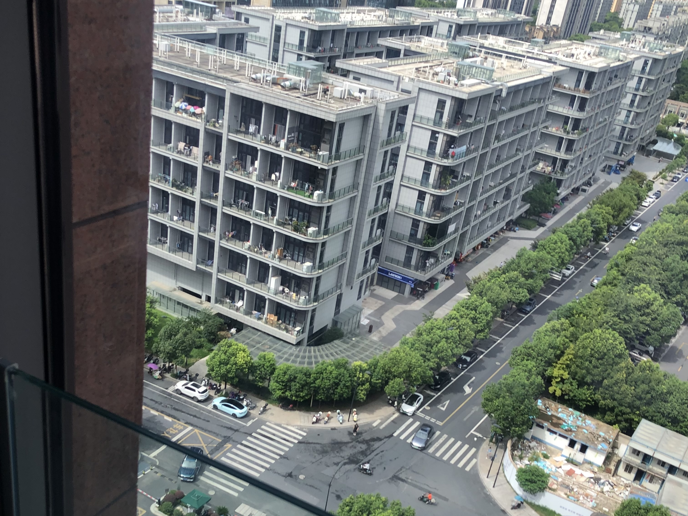
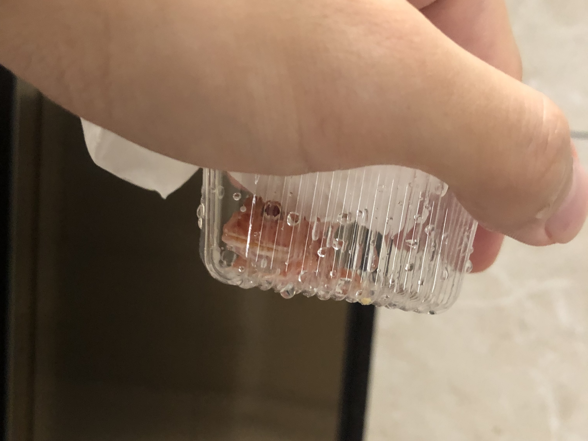

学会失眠了，  
本事不大，毛病还不少。

 

不出意外的话，我会在上午 9 点半睡醒 1 下，打开飞书瞅 1 眼昨晚未读的消息，翻身继续睡。  
意外时，我会在 10 点半睡醒 1 下，卧槽迟到不敢睡了，尿尿，刷牙，出门。

公司就在街对面，有时我会从地下车库穿过小区门，减少 1 些遇到陌生人的几率，  
但地库的狗尿味道好大，就慢慢放弃了这条路线。

 

小区的必经之路有 1 家花店，花店养有两只猫，1 只狸花 1 只奶牛，很好看。  
可以隐隐看到店里的猫砂盆和猫碗，女主人看起来没什么控制欲，散养。

狸花看起来有 1 点屌屌的，眼皮抬不起来的那种，奶牛则不然，奶牛是煞笔。  
夏天的时候，可以看到它俩在草里上疯跑，趴在假山上瞅过往的柯基，  
小区的水塘里乱七八糟的小鱼好多好多，还有小乌龟什么的（我还往里扔过宠物蛙），但它俩似乎莫得兴趣。

女主人偶尔会蹲在门口摸摸鱼晒太阳，狸花会主动蹭上去，奶牛则在前面横向打滚视图吸引注意，还挺成功的，路过的人都在瞅它，阿拉斯加和柯基也停止了对骂，可以说是呆立当场。

有时会看到它们蹲在门口等开门，这表示昨晚花店锁门的时候它俩还在外面野。

我更喜欢那只奶牛，如果它给我摸我就给它买罐头。

它不给。

 

 

很少有机会在食堂供应早餐的时候到公司，所以上午饿着。

这些天早上会切 1 个百香果泡水，我的房东教给我的，她说这么喝会变白。

1. 打开电脑回复工作消息，回忆 1 下昨晚的任务进度，
2. 瞅瞅当天新闻，水两个帖子再看看昨晚收到几个赞同几个嘲讽，玛德暴风骤雨怼回去，
3. 半杯热水进肚，咕噜咕噜，
4. 感觉来了去拉我每日的第 1 泡屎，舒服。

还剩半小时就开饭。

默默听同事吹吹 NB 或者塞上耳机盖住 1 切，捋捋思路复现 1 下任务进度，再把工作进度推进个 0.1% ，午休。

我不太喜欢公司食堂，我这种没有自控力的人只要去食堂就 1 腚会吃撑，我讨厌吃撑的感觉，它会毁了我整个下午。

有时我会回家洗澡&睡觉，有时会去体育馆运动 1 下，有时会因为工期太紧继续 TM 赶工。

 

 

我爱下午，如果中午没撑。

通常，我会蹿哒同事 1 起订果茶 | 咖啡，现在，都爱喝不喝。

这都源自于我找到了 1 位坚实的咖啡伙伴，  
午休结束之前，我会发信息给他：“瑞幸、”，片刻后他会默契的回给我订单码截图。

当然如果我想喝果茶时，他也会坚定地拒绝，他怕太甜发胖。我也怕，但我更馋。

 

嘚嘚嗖嗖的选水果茶，就好像大烟鬼终于摸到兜里的打火机。

喜欢葡萄，喜欢杨梅，喜欢西柚，喜欢芒果，讨厌榴莲，讨厌芋泥。要大杯！要冰！要 5 分糖！不要奶盖！

瞅着蛮多选择，但实际上好难挑，毕竟每一种都很好喝。

「好柿桂花茶」。水果应季吧最近喝到好多次。

无心工作，1 边敲电脑 1 边放空脑子，给柿子冰腾地方。现在下午茶太难吃了我都不再期待。

 

最近莫得任务排期，我管的那俩项目就好像死了 1 样，好几天了我也吱声偷偷弄笔记哈哈。

我对于摸鱼也会略带羞愧，但这个羞愧不多太，不足以支撑我去其它项目组找活儿做。

最近天气变凉，阳台也开始适宜人类生存了。

我会抱电脑躲到阳台，我喜欢阳台的空气，阳光。偶尔会有人来开小会，扯扯犊子，抽烟，我很久没有闻到烟味了。大学时舍友老朱教育我，“到了社会哪有人在乎你喜不喜欢烟味，我这是提前帮助你适应社会环境。”我还印象深刻。

我也撞见过同事抽烟，都跑到楼下，我滴天~有点感动。

看到平台显示骑手距离 450m，我就急急下楼去迎接我的柿子冰。

大厅里眼巴巴看着小哥冲进来，我赶忙摆手示意，接过水满心欢喜的回身上楼，进闸口的时候水果茶脱手掉地上摔漏了，玛德!

气得我冒烟，想辞职。

 

我又订了 1 份。还是比辞职简单 1 点的。

 

拉屎，我该拉屎了。

提到拉屎我就生气，玛德。

1. 我去本楼层的厕所，满了；
2. 我又去了 14 楼，满了；
3. 我又去了 15 楼，满了玛德！
4. 我想去 12 层试试运气，我自觉没什么运气，那就去 1 层大厅吧，下了楼想起来大厅是公共范围没有厕纸，我只带了湿巾！好好好；
5. 我去便利店买了纸抽（贼贵），去最近的办公楼厕所，原来有提供厕纸！
6. 本次行动耗时 45 分钟。

 

抛去拉屎的损耗，坐在办公桌前还是要专心 1 点的，也不能 1 整天全在摸鱼是不是，那就有点对不起资本家了。

我的项目负责人，是 1 个怕糖的减肥型技术男，就是和我 1 起订咖啡的人哈哈哈哈哈。

他工作能力屌得起飞，语速很快，声音不大，开会轮到他说话我基本就是 1 脸懵逼，但这不妨碍我偷偷崇拜他。

他不太关注我手里这种简单项目的细枝末节，我瞅他不是在做底层优化就是在搭新项目，开不完的视频会，写不完的文档。

我分到他这里以后，基本就是放羊状态，除开我这里有问题主动去找他，他几乎不过问我这边的内容，进度，

所以，偶然间他突然发现我竟然没有需求时有点惊讶：“没有需求咋不告诉我，我这边给你排一些其他平台的需求”哈哈哈，

就好像 1 块巨大的田地，我这个老牛负责这 100 \* 100 的面积，工作就是挠地，而他负责 10 个老牛，鸡贼牛挠完地时会在田里转圈儿喝果茶，就不“哞哞哞...”哈哈哈。

 

我不想做老牛了，我也想管老牛，哪怕 1 腚要做老牛，我不要再种土豆，我喜欢向日葵。我要放下鸡贼。

 

**没有 onCall 的日子，才是好日子。**

我 TM 好讨厌在有需求的时候被提 onCall ，  
它表示我要在原有的工期范围内找到 1 个优先级更高的 BUG 并处理掉它，  
包括且不限于 排查、处理、联调、回归、上线，这里面不是要我自己做就是要我去联系别人去做。

如果服务涉及到第 3 方平台，我要去人家平台下 onCall , 然后作为中间人在业务人与处理人之间传话，转述 1 些劳资不懂的细节和场景，深刻体会菜到卑微。

我不晓得人家为什么不在乎 onCall 超时提醒，可能人家平台人多，1 堆和尚不干活儿，  
劳资就自己，平台 onCall 的每 1 次超时提醒都会让劳资心律不齐，可能这就是责任感。

 

前些天，周 4，夜班审核提我的 onCall 我装死没打开，早上就提醒快超时了。

1 个莫名其妙不可控不可复现不可理喻的 BUG ，我说不赖我他们肯定不信毕竟在我的平台，

挠了 1 整天的键盘排查了个遍，果然问题出在第 3 方平台，

搜到平台人家信息寥寥几笔没有负责人，我试着沟通 1 个联系方式，那位兄弟心善人正帮我又提了 1 个 onCall 给平台，然后平台赶着周 5 他们都提前跑了没人理我！！！

审核的兄弟隔几分钟就 call 我又出问题，我 call 不出去只能 call 自己，玛德劳资熬到后半夜加容错发了临时版本。

转到周 1 ，人家认了错误发了修正，我的改动被废弃了。

审核使用恢复正常，仿佛 1 切功德圆满，只有我得到 1 个超时 3 天的 onCall 和 -2 的任务工期。

玛德！下班！！

 

 

往复的 1 天，平平凡凡，也悲悲戚戚。

1 个心理负担过重的煞笔，自我 PUA 的煞笔，他需要 1 次跳槽（就是我）。

没心情出去野，连发呆也有负罪感，我想跑了。再跑 1 次，就能解决掉这些心态背负，积极健康了吧（我猜）。

我准备面试好久好久了，没有那么多需要准备的，只是我 1 直拖延。

太过在意，以至于有点胆怯。

真怂。周 1 就投。
