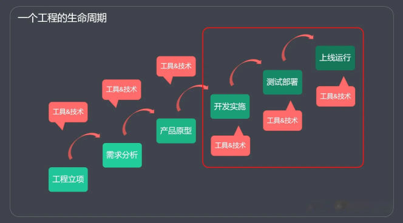
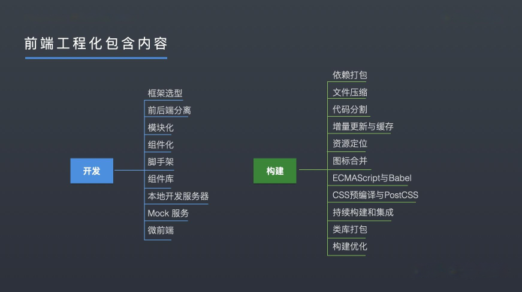
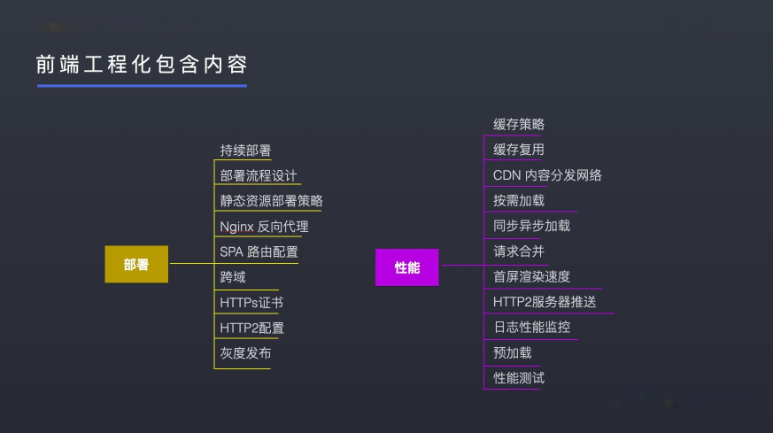
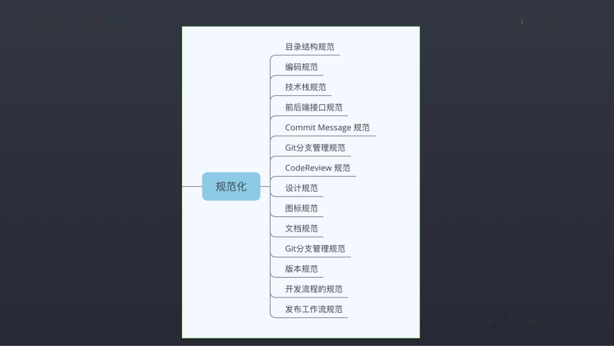

> 前端工程化是把软件工程相关的方法和思想应用到前端开发中。

一个项目的开发，大部分开发的参与者都是处于整个开发生命周期其中的一个环节。

进行工程化，需要从整个生命周期的角度理解项目的开发步骤。前端只涉及生命周期的后半部分。

 

前端工程化就是通过各种工具和技术，提升前端开发效率的过程。

前端工程化不是具体的某项技术和方法，也没有绝对正确的标准答案。  
公司的组织架构、产品形态、所处的阶段不同可能工程化具体的方法和实践完全不一样。

可以简单的分为：开发、构建、部署、性能、规范化。

 

 

前端工程化之所以成功和繁荣，有一个关键性角色，不容忽视，那就是 Node.js，可以这么说，前端工程化就是在 Node 的基础上发展的。
