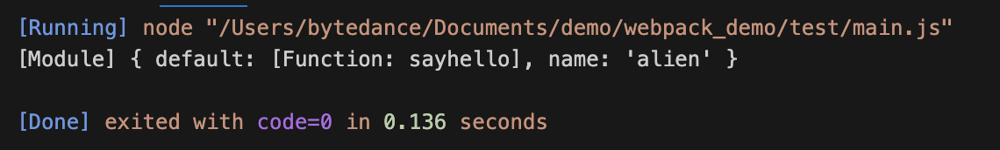

早期的 JS 项目很简单，一个项目共享作用域是可以的，随着 web 的发展项目越发复杂，需要大量引用外部 JS 文件，共用作用域会不可避免的发生声明覆盖和被动修改的情况。

拥有私用作用域，有限可控的抛出能力的组件成为必然发展趋势。

# Commonjs

commonJs 本质上是一种社区规范，实现上是利用函数作用域实现变量隔离达成的模块化能力，所以兼容性上没有问题。

特点：

- commonjs 中每个 js 文件都是一个单独的模块，称之为 module
- module 中包含了 commonjs 的核心变量：exports、module.exports、require；
- exports 和 module.exports 可以负责对模块的内容进行导出
- require 可以导入模块（包括：系统模块，自定义模块，第三方库模块）

```js
let name = "《React进阶实践指南》";
module.exports = function sayName() {
  return name;
};
```

```js
const sayName = require("./hello.js");
module.exports = function say() {
  return {
    name: sayName(),
    author: "我不是外星人",
  };
};
```

<br>

每个模块文件中默认存在 `exports`，`require`，`module` 三个变量，可以直接使用它们。在 nodejs 中还存在 `__filename` 和 `__dirname` 变量。

- `exports` 当前模块导出的属性；
- `require` 引入模块的方法；
- `module` 记录当前模块信息；

```js
(function (exports, require, module, __filename, __dirname) {
  const sayName = require("./hello.js");
  module.exports = function say() {
    return {
      name: sayName(),
      author: "我不是外星人",
    };
  };
});
```

在 Commonjs 规范下模块中，会形成一个包装函数，代码将作为包装函数的执行上下文，使用的 `require` ，`exports` ，`module` 本质上是通过形参的方式传递到包装函数中的：

```js
function wrapper(script) {
  return (
    "(function (exports, require, module, __filename, __dirname) {" +
    script +
    "\n})"
  );
}
```

包装函数执行。

```js
const modulefunction = wrapper(`
  const sayName = require('./hello.js')
    module.exports = function say(){
        return {
            name:sayName(),
            author:'我不是外星人'
        }
    }
`);
```

modulefunction 暂时是一个字符串。

```js
runInThisContext(modulefunction)(
  module.exports,
  require,
  module,
  __filename,
  __dirname
);
```

在模块加载的时候，会通过 runInThisContext (可以理解成 eval ：字符串解析执行) 执行 `modulefunction` ，传入`require` ，`exports` ，`module` 等参数。

## require

```js
const fs = require("fs"); // ①核心模块
const sayName = require("./hello.js"); // ② 文件模块
const crypto = require("crypto-js"); // ③第三方自定义模块
```

当 require 方法执行时，会接收一个唯一参数作为一个标识符，commonjs 对于不同标识符的处理流程不相同，但是**目的都是为了找到对应的模块**。

**require 加载标识符原则**

- 首先像 fs ，http ，path 等标识符，会被作为 nodejs 的**核心模块**。
- `./` 和 `../` 开头作为相对路径的**文件模块**， `/` 开头作为绝对路径的**文件模块**。
- 非路径形式也非核心模块的模块，将作为**自定义模块**

**核心模块的处理：**

核心模块的优先级仅次于缓存加载，已被预先编译成二进制代码，所以加载核心模块过程速度最快。

**路径形式的文件模块处理：**

已 `./` ，`../` 和 `/` 开始的标识符，会被当作文件模块处理。`require()` 方法会将路径转换成真实路径，并以真实路径作为索引，将编译后的结果缓存起来，第二次加载的时候会更快。

**自定义模块处理：** 自定义模块，一般指的是非核心的模块，它可能是一个文件或者一个包，它的查找会遵循以下原则：

- 在当前目录下的 `node_modules` 目录查找。
- 如果没有，在父级目录的 `node_modules` 查找，如果没有在父级目录的父级目录的 `node_modules` 中查找。
- 沿着路径向上递归，直到根目录下的 `node_modules` 目录。
- 在查找过程中，会找 `package.json` 下 main 属性指向的文件，如果没有 `package.json` ，在 node 环境下会以此查找 `index.js` ，`index.json` ，`index.node` 。


**require 模块引入和处理**

CommonJS 模块**同步加载并执行**模块文件，  
执行阶段分析模块依赖，采用**深度优先遍历**，执行顺序是父 -> 子 -> 父。  
例：

```js
// a.js
const getMes = require("./b");
console.log("这里是 a 文件");
exports.say = function () {
  const message = getMes();
  console.log(message);
};
```

```js
// b.js
const say = require("./a");
const object = {
    name: '《REACT 进阶实践指南》',
    author: '外星人'
};
console.log("这里 b 文件");
module.exports = function () {
  return object;
};
```

```js
// main.js
const a = require("./a");
const b = require("./b");

console.log("node 入口文件");
```

接下来终端输入 `node main.js` 运行 `main.js`，效果如下：


从上面的运行结果可以得出以下结论：

- `main.js` 和 `a.js` 模块都引用了 `b.js` 模块，但是 `b.js` 模块只执行了一次。
- `a.js` 模块 和 `b.js` 模块互相引用，但是没有造成循环引用的情况。
- 执行顺序是父 -> 子 -> 父；

**require 加载原理**

首先， `module` 和 `Module`：

**`module`** ：在 Node 中每一个 js 文件都是一个 module ，module 上保存了 exports 等信息之外，还有一个 **`loaded`** 表示该模块是否被加载。

- 为 `false` 表示还没有加载；
- 为 `true` 表示已经加载

**`Module`** ：以 nodejs 为例，整个系统运行之后，会用 `Module` 缓存每一个模块加载的信息

require 的源码大致如下：

```js
 // id 为路径标识符
function require(id) {
   /* 查找  Module 上有没有已经加载的 js  对象*/
   const cachedModule = Module._cache[id]

   /* 如果已经加载了那么直接取走缓存的 exports 对象  */
   if (cachedModule) {
    return cachedModule.exports
  }

  /* 创建当前模块的 module  */
  const module = { exports: {} ,loaded: false , ...}

  /* 将 module 缓存到  Module 的缓存属性中，路径标识符作为 id */
  Module._cache[id] = module
  /* 加载文件 */
  runInThisContext(wrapper('module.exports = "123"'))(module.exports, require, module, __filename, __dirname)
  /* 加载完成 */
  module.loaded = true
  /* 返回值 */
  return module.exports
}
```

- require 会接收一个参数——文件标识符，然后分析定位文件，从 Module 上查找缓存，如果有就直接返回；
- 如果没有缓存会创建一个 module 对象，**缓存到 Module 上，然后执行文件**，加载文件，将 loaded 属性设置为 true ，返回 module.exports ，完成模块加载流程；
- 模块导出就是 return module.exports 变量，基本类型导出的是值， 引用类型导出的是引用地址；
- exports 和 module.exports 持有相同引用，因为最后导出的是 module.exports， 所以对 exports 进行赋值会导致 exports 操作的不再是 module.exports 的引用；

**require 避免重复加载，循环引用**

require 通过缓存先将加载的文件缓存到 Module 中，下次再引用直接读取缓存值 module，无需重新再次执行模块。

- ① 首先执行 `node main.js` ，那么开始执行第一行 `require(a.js)`；
- ② 那么首先判断 `a.js` 有没有缓存，因为没有缓存，先加入缓存，然后执行文件 a.js （**需要注意 是先加入缓存， 后执行模块内容**）;
- ③ a.js 中执行第一行，引用 b.js。
- ④ 那么判断 `b.js` 有没有缓存，因为没有缓存，所以加入缓存，然后执行 b.js 文件。
- ⑤ b.js 执行第一行，再一次循环引用 `require(a.js)` 此时的 a.js 已经加入缓存，直接读取值。接下来打印 `console.log('我是 b 文件')`，导出方法。
- ⑥ b.js 执行完毕，回到 a.js 文件，打印 `console.log('我是 a 文件')`，导出方法。
- ⑦ 最后回到 `main.js`，打印 `console.log('node 入口文件')` 完成这个流程。

不过这里我们要注意问题：

- 如上第 ⑤ 的时候，当执行 b.js 模块的时候，因为 a.js 还没有导出 `say` 方法，所以 b.js 同步上下文中，获取不到 say。

为了进一步验证上面所说的，我们改造一下 `b.js` 如下:

```js
const say = require('./a')
const  object = {
    name: '《REACT 进阶实践指南》',
    author: '外星人'
}
console.log('这里是 b 文件')
console.log('打印 a 模块' , say)

setTimeout(()=>{
    console.log('异步打印 a 模块' , say)
},0)

module.exports = function(){
    return object
}
```

打印结果：


- 第一次打印 say 为空对象。
- 第二次打印 say 才看到 b.js 导出的方法。

获取到 say 有两种办法：

- 一是用动态加载 a.js 的方法，
- 二个就是如上放在异步中加载，

 a.js 是用 `exports.say` 方式导出的，如果 a.js 用 module.exports 结果会有所不同。

**require 动态加载**

require 可以在任意的上下文，动态加载模块。

```js
// a.js
console.log('我是 a 文件')
exports.say = function(){
    const getMes = require('./b')
    const message = getMes()
    console.log(message)
}
```

```js
// main.js
const a = require('./a')
a.say()
```

打印结果如下：


require 本质上就是一个函数，那么函数可以在任意上下文中执行，来自由地加载其他模块的属性方法。

# ES Module

`ES6` 开始， `JavaScript` 真正意义上有自己的模块化规范，ESModule 的产生有很多优势:

- 借助 `Es Module` 的静态导入导出的优势，实现了 `tree shaking`。
- `Es Module` 还可以 `import()` 懒加载方式实现代码分割。

在 `ESModule` 中用 `export` 用来导出模块，`import` 用来导入模块。 `export` 配合 `import` 会有很多种组合情况。

**导出 exports 和导入 import**

```js
const name = '《React进阶实践指南》'
const author = '我不是外星人'
export { name, author }
export const say = function (){
    console.log('hello , world')
}
```

```js
// name , author , say 对应 a.js 中的  name , author , say
import { name , author , say } from './a.js'
```

**默认导出 export default**

```js
const name = '《React进阶实践指南》'
const author = '我不是外星人'
const say = function (){
    console.log('hello , world')
}
export default {
    name,
    author,
    say
}
```

```js
import mes from './a.js'
console.log(mes) //{ name: '《React进阶实践指南》',author:'我不是外星人', say:Function }
```

**混合导入｜导出**

```js
export const name = '《React进阶实践指南》'
export const author = '我不是外星人'
export default  function say (){
    console.log('hello , world')
}
```

```js
import theSay , { name, author as  bookAuthor } from './a.js'
console.log(
    theSay,     // ƒ say() {console.log('hello , world') }
    name,       // "《React进阶实践指南》"
    bookAuthor  // "我不是外星人"
)
```

```js
import theSay, * as mes from './a'
console.log(
    theSay, // ƒ say() { console.log('hello , world') }
    mes // { name:'《React进阶实践指南》' , author: "我不是外星人" ，default:  ƒ say() { console.log('hello , world') } }
)
```

**重属名导入**

```js
import {  name as bookName , say,  author as bookAuthor  } from 'module'
console.log( bookName , bookAuthor , say ) //《React进阶实践指南》 我不是外星人
```

**重定向导出**

可以把当前模块作为一个中转站，一方面引入 module 内的属性，然后把属性再给导出去。

```js
export * from 'module' // 第一种方式
export { name, author, say } from 'module' // 第二种方式
export { name as bookName ,  author as bookAuthor , say } from 'module' //第三种方式
```
**无需导入模块，只运行模块**

```js
import 'module'
```

执行 module 不导出值 多次调用 `module` 只运行一次。

**动态导入**

```js
const promise = import('module')
```

`import('module') `，动态导入返回一个 `Promise`。为了支持这种方式，需要在 webpack 中做相应的配置处理。

## 静态语法

ESModule 的引入和导出是静态的，`import` 会自动提升到代码的顶层 ，`import` , `export` 不能放在块级作用域或条件语句中。

```js
// 错误写法
function say(){
  import name from './a.js'
  export const author = '我不是外星人'
}
```

```js
// 错误写法
isexport &&  export const  name = '《React进阶实践指南》'
```

这种静态语法，在编译过程中确定了导入和导出的关系，所以更方便去查找依赖，更方便去 `tree shaking` (摇树) ， 可以使用 lint 工具对模块依赖进行检查，可以对导入导出加上类型信息进行静态的类型检查。

import 的导入名不能为字符串或在判断语句。

```js
// 错误写法
import 'defaultExport' from 'module'let name = 'Export'
import 'default' + name from 'module'
```

## 执行特性

ESModule 和 Common.js 一样，对于相同的 js 文件，会保存静态属性。

但是与 Common.js 不同的是 ，`CommonJS ` 模块同步加载并执行模块文件，ESModule **提前加载并执行模块文件**，  
ESModule 在预处理阶段分析模块依赖，在执行阶段执行模块，两个阶段都采用深度优先遍历，执行顺序是子 -> 父。

```js
// main.js
console.log('main.js开始执行')
import say from './a'
import say1 from './b'
console.log('main.js执行完毕')
```

```js
// a.js
import b from './b'
console.log('a模块加载')
export default  function say (){
    console.log('hello , world')
}
```

```js
// b.js
console.log('b模块加载')
export default function sayhello(){
    console.log('hello,world')
}
```

- `main.js` 和 `a.js` 都引用了 `b.js` 模块，但是 b 模块也只加载了一次。
- 执行顺序是子 -> 父

结果如下：


## 导出绑定

**不能修改 import 导入的属性**

```js
// a.js
export let num = 1
export const addNumber = ()=>{
    num++
}
```

```js
import {  num , addNumber } from './a'
num = 2
```

直接修改会报错：


```js
import {  num , addNumber } from './a'
console.log(num) // num = 1
addNumber()
console.log(num) // num = 2
```

总结：

- 使用 import 被导入的模块运行在严格模式下。
- 使用 import 被导入的变量是只读的，可以理解默认为 const 装饰，无法被赋值
- 使用 import 被导入的变量是与原变量绑定/引用的，可以理解为 import 导入的变量无论是否为基本类型都是引用传递。

### import()动态引入

`import()` 返回一个 `Promise` 对象， 返回的 `Promise` 的 then 成功回调中，可以获取模块的加载成功信息。

- 首先 `import()` 动态加载一些内容，可以放在条件语句或者函数执行上下文中；
- `import()` 可以实现懒加载，如 vue 中的路由懒加载；

```js
// main.js
setTimeout(() => {
    const result  = import('./b')
    result.then(res=>{
        console.log(res)
    })
}, 0);
```
```js
//b.js
export const name ='alien'
export default function sayhello(){
    console.log('hello,world')
}
```

打印如下：



### tree shaking 实现

Tree Shaking 在 Webpack 中的实现，是用来尽可能的删除没有被使用过的代码，一些被 import 了但其实没有被使用的代码。比如以下场景：

```js
// a.js
export let num = 1
export const addNumber = ()=>{
    num++
}
export const delNumber = ()=>{
    num--
}
```

```js
// main.js
import {  addNumber } from './a'
addNumber()
```

如上 `a.js` 中暴露两个方法，`addNumber`和 `delNumber`，但是整个应用中，只用到了 `addNumber`，那么构建打包的时候，`delNumber`将作为没有引用的方法，不被打包进来。

# 总结

`Commonjs` 的特性如下：

- CommonJS 模块由 JS 运行时实现。
- CommonJs 是单个值导出，本质上导出的就是 exports 属性。
- CommonJS 是可以动态加载的，对每一个加载都存在缓存，可以有效的解决循环引用问题。
- CommonJS 模块同步加载并执行模块文件。

`ESModule` 的特性如下：

- ES6 Module 静态的，不能放在块级作用域内，代码发生在编译时。
- ES6 Module 的值是动态绑定的，可以通过导出方法修改，可以直接访问修改结果。
- ES6 Module 可以导出多个属性和方法，可以单个导入导出，混合导入导出。
- ES6 模块提前加载并执行模块文件，
- ES6 Module 导入模块在严格模式下。
- ES6 Module 的特性可以很容易实现 Tree Shaking 和 Code Splitting。
