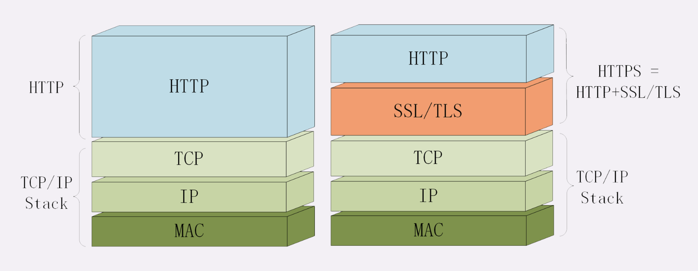
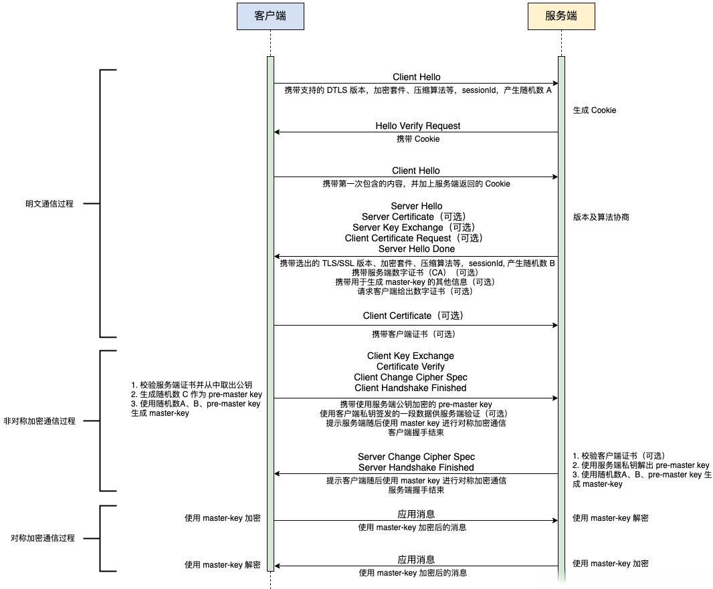

HTTP 存在 1 些缺点，其中的“无状态”在加入 Cookie 后得到了解决，而另两个缺点——“明文”和“不安全”仅凭 HTTP 自身是无力解决的，需要引入新的 HTTPS 协议。

**什么是安全**

通常认为，如果通信过程具备了这四个特性，就可以认为是“安全”的：**机密性、完整性，身份认证和不可否认**。

机密性（Secrecy/Confidentiality）是指对数据的“保密”，只能由可信的人访问。

完整性（Integrity，也叫一致性）是指数据在传输过程中没有被篡改，没有变化。

身份认证（Authentication）是指确认对方的真实身份，保证消息只能发送给可信的人。

不可否认（Non-repudiation/Undeniable），指不能否认已经发生过的行为。

同时拥有上述特性，通信双方的利益才能有保障，才能算得上是真正的安全。

## HTTPS

**为什么要有 HTTPS**

简单的回答是“因为 HTTP 不安全”。

由于 HTTP 天生“明文”的特点，整个传输过程完全透明，任何人都能够在链路中截获、修改或者伪造请求 / 响应报文，数据不具有可信性。

> 比如“代理服务”。它作为 HTTP 通信的中间人，在数据传递时可以添加或删除部分头字段，也可以使用黑白名单过滤 body 里的关键字，甚至直接发送虚假的请求、响应，而浏览器和源服务器都没有办法判断报文的真伪。

 

对于网络购物、网上银行、证券交易等需要高度信任的应用场景来说是非常致命的。如果没有基本的安全保护，使用互联网进行各种电子商务、电子政务就根本无从谈起。

对于安全性要求不那么高的新闻、视频、搜索等网站来说，由于互联网上的恶意用户、恶意代理越来越多，也很容易遭到“流量劫持”的攻击，在页面里强行嵌入广告，或者分流用户，导致各种利益损失。

对于普通用户来说，HTTP 不安全的隐患更大，上网的记录会被轻易截获，网站是否真实也无法验证，黑客可以伪装成银行网站，盗取真实姓名、密码、银行卡等敏感信息，威胁人身安全和财产安全。

**什么是 HTTPS**

HTTPS 是 HTTP 的安全版，它在 HTTP 基础上加入了 SSL/TLS 协议。

> HTTPS 是一个“非常简单”的协议，规定了新的协议名“https”，默认端口号 443，至于其他完全沿用 HTTP。也就是说，除了协议名“http”和端口号 80 这两点不同，HTTPS 协议在语法、语义上和 HTTP 完全一样。

HTTPS 中的“S”是 SSL/TLS，它在 HTTP 与 TCP/IP 之间建立了一个安全的通信通道，使得 HTTP 具有了加密、认证、完整性保护等功能。

## SSL/TLS

SSL 即安全套接层（Secure Sockets Layer），1 共 3 个版本。

TLS 即传输层安全（Transport Layer Security）。

SSL 和 TLS 都是 1 种密码通信框架，TLS1.0 实际上是 SSL3.1。

## 加密

对称加密和非对称加密，以及两者结合起来的混合加密，实现了机密性。

**对称加密**

“对称加密”指加密和解密时使用的密钥都是同 1 个。只要保证了密钥的安全，那整个通信过程就可以说具有了机密性。

这里**秘钥交换**的安全问题还需要外部来解决。

**非对称加密**

非对称加密有两个密钥，一个叫“公钥”（public key），一个叫“私钥”（private key）。两个密钥是不同的，公钥可以公开给任何人使用，而私钥必须严格保密。

公钥和私钥有个特别的“单向”性，虽然都可以用来加密解密，但公钥加密后只能用私钥解密，反过来，私钥加密后也只能用公钥解密。

非对称加密的效率很低，无法在 HTTP 通信全程都使用非对称加密。

**混合加密**

混合加密是指使用对称加密来加密数据，使用非对称加密来加密对称加密的密钥。

大概流程：

- 客户端发起请求，携带自身支持的对称加密和非对称加密算法列表，
- 服务器端收到列表，选择 1 组**密码套件**，配置公钥私钥，把选中的公钥和**密码套件**描述传递给客户端，
- 客户端检验公钥有效后，随机生成密钥KEY，使用公钥加密，传递给服务端，
- 服务端通过私钥解密得到密钥KEY，
- 双方使用密钥进行对称加密通信。

**OpenSSL**

OpenSSL 是 1 个著名的开源密码学程序库和工具包，几乎支持所有公开的加密算法和协议，已经成为了事实上的标准，许多应用软件都会使用它作为底层库来实现 TLS 功能。

## 数字签名与证书

通讯如果只有机密性，离安全还差的很远。

黑客虽然拿不到会话密钥解密密文，但可以通过窃听收集到足够多的密文，尝试暴力破解。

另外，黑客也可以伪造身份发布公钥，骗取用户的银行卡号、密码等敏感信息。

所以，在机密性的基础上还必须加上完整性、身份认证等特性，才能实现真正的安全。

**摘要算法**

摘要算法也就是常说的散列函数、哈希函数。

可以把摘要算法近似地理解成一种特殊的压缩算法，它能够把任意长度的数据“压缩”成固定长度、而且独一无二的“摘要”字符串，就好像是 1 个数字“指纹”。

也可以把摘要算法理解成 1 个“单向”加密算法，加密后的数据无法解密。

摘要算法实际上是把数据从一个“大空间”映射到了“小空间”，所以就存在“冲突”的可能性，可能会有两份不同的原文对应相同的摘要。好的摘要算法必须能够“抵抗冲突”，让这种可能性尽量地小。

因为摘要算法对输入具有“单向性”和“雪崩效应”，输入的微小不同会导致输出的剧烈变化，所以被 TLS 用来生成伪随机数。

MD5（Message-Digest 5）、SHA-1（Secure Hash Algorithm 1）都是常用的摘要算法，但这两个算法的安全强度比较低，不够安全，在 TLS 里已经被禁止使用了。
 
目前 TLS 推荐使用 SHA-2。

摘要算法保证了“数字摘要”和原文是完全等价。所以在原文后附上它的摘要就能够保证数据的**完整性**。

**数字签名**

使用私钥再加上摘要算法，就能够实现“数字签名”，同时实现“身份认证”和“不可否认”。

如果数字签名使用公钥解密成功，说明私钥和公钥是匹配的，消息是由私钥对应的人发出的。

又因为非对称加密效率太低，所以私钥只加密原文的摘要，这样运算量就小的多，且得到的数字签名也很小，方便保管和传输。

**数字证书和 CA**

> 数字证书与数字签名是对应出现的，数字证书用来为数字签名使用的公钥进行担保，由 CA 颁发。

因为任何人都可以在网络中发布公钥，要如何判断这个发布公钥人的身份，就是通信安全的最后 1 环。

从宏观的角度来看，任何担保人的自身身份都是未知的，是需要进行担保的，这样就形成了 1 个无限长的担保链。

CA 是 1 类世界公认可信的第 3 方，它强制打断了这个担保链，成为最终端，提供不容置疑的“身份认证”和“不可否认”。

Root CA 有自己的**自签名证书**，存储在计算机终端内，这样 Root CA 的真实性就得到了保证，且它会对信任的身份颁发**数字证书**对其进行担保。

> **数字证书**包含了公钥绑定在持有者身份，序列号、用途、颁发者、有效时间等等，把这些打成 1 个包再签名。

有了这个证书体系，操作系统和浏览器都内置了各大 CA 的根证书，上网的时候只要服务器发过来它的证书，就可以验证证书里的签名，顺着证书链（Certificate Chain）一层层地验证，直到找到根证书，就能够确定证书是可信的，从而里面的公钥也是可信的。

## TLS 握手

HTTPS 通信时在双方建立TCP连接后，还需要建立 TLS 连接，这个连接的建立需要 1 个 TLS 握手过程。

TLS 握手主要用于协商加密算法、交换加密密钥。

> TLS 协议由记录协议、握手协议、警告协议、变更密码规范协议、扩展协议等几个子协议组成，综合使用了对称加密、非对称加密、身份认证等许多密码学技术。浏览器和服务器在使用 TLS 建立连接时需要选择一组恰当的加密算法来实现安全通信，这些算法的组合被称为“密码套件”。

握手协议（Handshake Protocol）是 TLS 里最复杂的子协议，要比 TCP 的 SYN/ACK 复杂的多，浏览器和服务器会在握手过程中协商 TLS 版本号、随机数、密码套件等信息，然后交换证书和密钥参数，最终双方协商得到会话密钥，用于后续的混合加密系统。

步骤：

- `0.` 建立 TCP 连接；
- `1.` 浏览器会首先发一个“Client Hello”消息。包含客户端的版本号、支持的密码套件，1 个随机数（Client Random）；
- `2.` 服务器会返回一个“Server Hello”消息。包含版本号， 1 个随机数（Server Random），从给定列表中选 1 个通信密码套件；
- `3.` 服务器为了证明自己的身份，会把证书发给客户端（Server Certificate）；
- `4.` 服务器会发送“Server Key Exchange”消息，包含 Diffie-Hellman 公钥和私钥签名认证；
- `5.` 服务器发送“Server Hello Done”，表示打招呼完毕；
- `6.` 客户端收到 Server Hello 后，会通过证书链逐级验证服务器的证书，然后按照密码套件的要求也生成 Diffie-Hellman 公钥，把公钥发给服务器（Client Key Exchange）；
- `7.` 现在客户端和服务器手里都拿到了密钥交换算法的两个参数（Client Params、Server Params），得到“Pre-Master”，也是 1 个随机数；
- `8.` 客户端和服务器手里有了三个随机数：Client Random、Server Random 和 Pre-Master。用这 3 个随机数生成用于加密会话的主密钥，叫“Master Secret”；
- `9.` 客户端和服务器都生成了主密钥，就可以开始加密数据了。加密数据时，双方各自用主密钥生成加密密钥，然后用加密密钥加密数据，黑客即使得到了加密数据，也无法解密，因为他没有加密密钥。
- `10.` 客户端发送“Change Cipher Spec”；
- `11.` 客户端发送“Finished”，包含之前所有发送的数据的摘要，通过加密给服务器做验证；
- `12.` 服务器收到“Finished”后，验证信息后发送“Change Cipher Spec”，再生成自己的“Finished”，发送出去；
- `13.` 握手结束，数据开始加密传输；
- `14.` 当数据传输过程中，出现了错误，会用警告协议（Alert Protocol）交换错误信息。如果错误频繁出现，那么握手协议会协商重新握手，协商新的主密钥，然后重新加密数据；
- `15.` 当数据传输完成，握手协议会协商结束 TLS 连接；

## 双向认证

上面的流程是“单向认证”握手过程，只认证了服务器的身份，而没有认证客户端的身份。

这是因为通常单向认证通过后已经建立了安全通信，用账号、密码等简单的手段就能够确认用户的真实身份。

但为了防止账号、密码被盗，有的时候（比如网上银行）还会使用 U 盾给用户颁发客户端证书，实现“双向认证”，这样会更加安全。

双向认证的流程也没有太多变化，只是在“Server Hello Done”之后，“Client Key Exchange”之前，客户端要发送“Client Certificate”消息，服务器收到后也把证书链走一遍，验证客户端的身份。