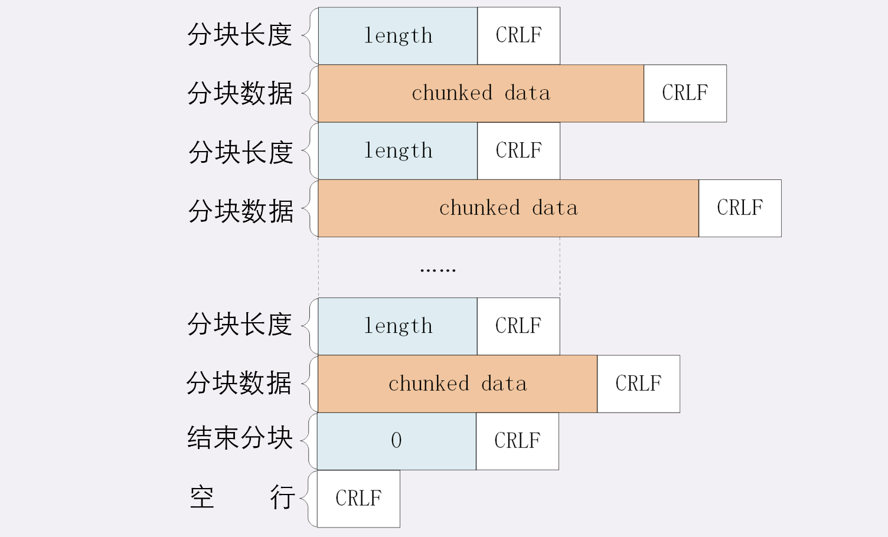
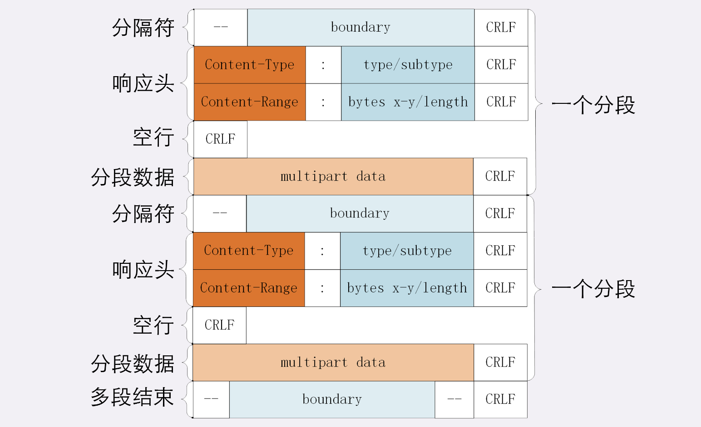

HTTP 可以传输很多种类的数据，不仅是文本，也能传输图片、音频和甚至所占内存相对庞大的视频等内容。

### 数据压缩

通常浏览器在发送请求时都会带着“Accept-Encoding”头字段，里面是浏览器支持的压缩格式列表，例如 gzip、deflate、br 等，这样服务器就可以从中选择一种压缩算法，放进“Content-Encoding”响应头里，再把原数据压缩后发给浏览器。

但 gzip 等压缩算法通常只对文本文件有较好的压缩率，而图片、音频视频等多媒体数据本身就已经是高度压缩的，再用 gzip 处理也不会变小，甚至会适得其反。

### 分块传输

> 服务器端将大文件“拆分“成多个小块，分批发给浏览器，浏览器收到后再组装复原。

响应报文中使用字段“Transfer-Encoding: chunked”表示报文的 body 部分会被分成了许多的块（chunk）逐个发送。  

分块传输也可以用于“流式数据”，当 body 数据的长度未知时无法在头字段“Content-Length”里给出确切的长度，所以也只能用 chunked 方式分块发送。

“Transfer-Encoding: chunked”和“Content-Length”这两个字段是互斥的，若同时出现“Transfer-Encoding: chunked”优先级更高。

分块传输的编码同样采用了明文的方式，很类似响应头：

- 每个分块包含两个部分，长度头和数据块；
- 长度头是以 CRLF（回车换行，即\r\n）结尾的一行明文，用 16 进制数字表示长度；
- 数据块紧跟在长度头后，最后也用 CRLF 结尾，但数据不包含 CRLF；
- 最后用一个长度为 0 的块表示结束，即“0\r\n\r\n”。



<br>

```http
HTTP/1.1 206 OK

Content-Type: text/plain
Transfer-Encoding: chunked
Connnection: keep-alive

13
chunkedData 1
13
chunkedData 2
13
chunkedData 3
```

> 注意：浏览器在收到分块传输的数据后会自动按照规则去掉分块编码，重新组装出内容。

### 范围请求

#### 单段数据

HTTP 的“范围请求”（range requests），允许客户端在请求头里使用专用字段来表示只获取文件的一部分。

范围请求不是 Web 服务器必备的功能，服务器必须在响应头里使用字段“Accept-Ranges: bytes”明确支持。反之服务器可以标记字段“Accept-Ranges: none”或者不标记“Accept-Ranges”字段，这样客户端会认为服务器不支持范围请求。

<br>

请求头的 Range 字段用以标记范围请求需求，格式是“bytes=x-y”，其中的 x 和 y 是以字节为单位的数据范围。

```http
GET / HTTP/1.1
Host: www.chrono.com
Range: bytes=0-1023
```

服务器收到 Range 字段后：

- 首先会检查范围是否合法，比如范围越界时，服务器会返回状态码 416，表示“你的范围请求有误，无法处理”；
- 服务器会根据 Range 头计算偏移量，读取文件的片段了，返回状态码“206 Partial Content”，表示成功，且 body 只是原数据的一部分；
- 服务器要添加一个响应头字段 Content-Range，标记片段的实际偏移量和资源的总大小，格式是“bytes x-y/length”，与 Range 头区别在没有“=”，范围后多了总长度；

```http
HTTP/1.1 206 partial Content
Content-Length: 1024
Accept-Ranges: bytes
Content-Range: bytes 0-1023/2048

...
```

<br>

视频的拖拽进度需要范围请求，常用的下载工具里的多段下载、断点续传也是基于它实现的：

- 首先发个 HEAD，看服务器是否支持范围请求，同时获取文件的大小；
- 开 N 个线程，每个线程使用 Range 字段划分出各自负责下载的片段，发请求传输数据；
- 下载意外中断时根据上次的下载记录，用 Range 请求剩下的那一部分。

#### 多段数据

HTTP 还支持在 Range 头里使用多个“x-y”，一次性获取多个片段数据。  

这种情况需要使用一种特殊的 MIME 类型：“multipart/byteranges”，表示报文的 body 是由多段字节序列组成的，并且还要用一个参数“boundary=xxx”给出段之间的分隔标记。  

多段数据的格式与分块传输也比较类似，但它需要用分隔标记 boundary 来区分不同的片段。



```http
GET /16-2 HTTP/1.1
Host: www.chrono.com
Range: bytes=0-9, 20-29
```

```http
HTTP/1.1 206 Partial Content
Content-Type: multipart/byteranges; boundary=00000000001
Content-Length: 189
Connection: keep-alive
Accept-Ranges: bytes


--00000000001
Content-Type: text/plain
Content-Range: bytes 0-9/96

// this is
--00000000001
Content-Type: text/plain
Content-Range: bytes 20-29/96

ext json d
--00000000001--
```