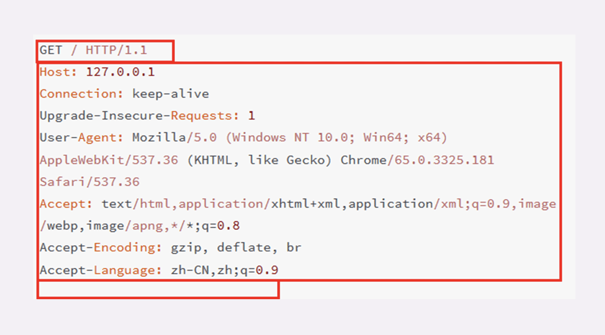

HTTP 协议的核心内容是报文。

HTTP 协议在规范文档里详细定义了报文的格式，规定了组成部分，解析规则，还有处理策略，所以可以在 TCP/IP 层之上实现更灵活丰富的功能，例如连接控制，缓存管理、数据编码、内容协商等等。

## 报文结构

HTTP 协议的请求报文和响应报文的结构基本相同，由三大部分组成：

- **起始行**（start line）：描述请求或响应的基本信息；
- **头部字段集合**（header）：使用 key-value 形式更详细地说明报文；
- **消息正文**（entity）：实际传输的数据，它不一定是纯文本，可以是图片、视频等二进制数据。

> 其中前两部分起始行和头部字段经常又合称为**请求头**或**响应头**，消息正文又称为**实体**，  
与**header**对应，很多时候就直接称为**body**。

HTTP协议规定报文必须有 header，但可以没有 body，而且在 header 之后必须要有一个**空行**，也就是**CRLF**。



### 请求行

请求行是请求报文的起始行。

请求行简要地描述了客户端想要如何操作服务器端的资源。

构成：

- 请求方法：是一个动词，如 GET/POST，表示对资源的操作；
- 请求目标：通常是一个 URI，标记了请求方法要操作的资源；
- 版本号：表示报文使用的 HTTP 协议版本。

```http
GET / HTTP/1.1
```

### 状态行

状态行是响应报文的起始行。

响应行表达了服务器响应的状态。

构成：

- 版本号：表示报文使用的 HTTP 协议版本；
- 状态码：一个三位数，用代码的形式表示处理的结果，比如 200 是成功，500 是服务器错误；
- 原因：作为数字状态码补充，是更详细的解释文字，帮助人理解原因。

```http
HTTP/1.1 200 OK
```

```http
HTTP/1.1 404 Not Found
```

### 头部字段 

> 请求行或状态行再加上头部字段集合就构成了 HTTP 报文里完整的请求头或响应头。  请求头和响应头的结构是基本一样的，唯一的区别是起始行。

头部字段是 key-value 的形式，key 和 value 之间用“:”分隔，最后用 CRLF 换行表示字段结束。  
HTTP 头字段很灵活，支持添加自定义头。

注意下面几点：

- 字段名不区分大小写，例如“Host”也可以写成“host”，但首字母大写的可读性更好；
- 字段名里不允许出现空格，可以使用连字符“-”，但不能使用下划线“_”；
- 字段名后面必须紧接着“:”，不能有空格，而“:”后的字段值前可以有多个空格；
- 字段的顺序是没有意义的，可以任意排列不影响语义；
- 字段原则上不能重复，除非这个字段本身的语义允许，例如 Set-Cookie。

#### 常用头字段

 HTTP 协议规定了非常多的头部字段，实现各种各样的功能，但基本上可以分为四大类：

- 通用字段：在请求头和响应头里都可以出现；
- 请求字段：仅能出现在请求头里，进一步说明请求信息或者额外的附加条件；
- 响应字段：仅能出现在响应头里，补充说明响应报文的信息；
- 实体字段：它实际上属于通用字段，但专门描述 body 的额外信息。

例如：

**Host 字段**，属于请求字段，只能出现在请求头里，它同时也是唯一一个 HTTP/1.1 规范里要求必须出现的字段。它告诉服务器这个请求应该由哪个主机来处理，当一台计算机上托管了多个虚拟主机的时候，服务器端就需要用 Host 字段来选择，有点像是一个简单的“路由重定向”。

**User-Agent 请求字段**，只出现在请求头里。它使用一个字符串来描述发起 HTTP 请求的客户端，服务器可以依据它来返回最合适此浏览器显示的页面。但由于历史的原因，User-Agent 非常混乱，最终变得毫无意义。

**Date 字段**是一个通用字段，但通常出现在响应头里，表示 HTTP 报文创建的时间，客户端可以使用这个时间再搭配其他字段决定缓存策略。

**Server 字段**是响应字段，只能出现在响应头里。它告诉客户端当前正在提供 Web 服务的软件名称和版本号。它不是必要字段，且它会把服务器的一部分信息暴露给外界，所以部分网站响应头里要么没有这个字段，要么就给出一个完全无关的描述信息。

**Content-Length**，实体字段，它表示报文里 body 的长度，也就是请求头或响应头空行后面数据的长度。服务器看到这个字段，就知道了后续有多少数据，可以直接接收。如果没有这个字段，那么 body 就是不定长的，需要使用 chunked 方式分段传输。

<br>

## 状态码

RFC 标准里规定的状态码是三位数，0~99 不用，用数字的第一位表示分类，把状态码分成了五类：

- 1××：提示信息，表示目前是协议处理的中间状态，还需要后续的操作；
- 2××：成功，报文已经收到并被正确处理；
- 3××：重定向，资源位置发生变动，需要客户端重新发送请求；
- 4××：客户端错误，请求报文有误，服务器无法处理；
- 5××：服务器错误，服务器在处理请求时内部发生了错误。

在 HTTP 协议中，正确地理解并应用这些状态码是双方共同的责任。

目前 RFC 标准里总共有 41 个状态码，但实际上只有 10 种状态码是客户端必须处理的，且状态码的定义是开放的，允许自行扩展。

**1××**

1××类状态码属于提示信息，是协议处理的中间状态，实际能够用到的时候很少。  

偶尔能够见到的是“101 Switching Protocols”。它的意思是客户端使用 Upgrade 头字段，要求在 HTTP 协议的基础上改成其他的协议继续通信，比如 WebSocket。而如果服务器也同意变更协议，就会发送状态码 101，但这之后的数据传输就不会再使用 HTTP 了。

**2××**

2××类状态码表示服务器收到并成功处理了客户端的请求。

`200 OK` 是最常见的成功状态码，表示一切正常，如果是非 HEAD 请求，通常在响应头后都会有 body 数据。

`204 No Content` 是另一个很常见的成功状态码，它的含义与“200 OK”基本相同，但响应头后没有 body 数据。默认情况下 204 响应是可缓存的。

`206 Partial Content` 是 HTTP 分块下载或断点续传的基础，在客户端发送“范围请求”、要求获取资源的部分数据时出现，它与 200 一样，也是服务器成功处理了请求，但 body 里的数据不是资源的全部，而是其中的一部分。  
状态码 206 通常还会伴随着头字段“Content-Range”，表示响应报文里 body 数据的具体范围，供客户端确认，例如“Content-Range: bytes 0-99/2000”，意思是此次获取的是总计 2000 个字节的前 100 个字节。

**3××**

3××类状态码表示客户端请求的资源发生了变动，也就是“重定向”，包括著名的 301、302 跳转。

`301 Moved Permanently` 俗称“永久重定向”，含义是此次请求的资源已经不存在了，需要改用新的 URI 再次访问。

与它类似的是`302 Found`，俗称“临时重定向”，意思是请求的资源还在，但需要暂时用另一个 URI 来访问。

301 和 302 都会在响应头里使用字段 Location 指明后续要跳转的 URI，最终的效果很相似，浏览器都会重定向到新的 URI。两者的根本区别在于语义，一个是“永久”，一个是“临时”，所以在场景、用法上差距很大。  
比如，你的网站升级到了 HTTPS，原来的 HTTP 不打算用了，这就是“永久”的，所以要配置 301 跳转，把所有的 HTTP 流量都切换到 HTTPS。再比如，今天夜里网站后台要系统维护，服务暂时不可用，这就属于“临时”的，可以配置成 302 跳转，把流量临时切换到一个静态通知页面，浏览器看到这个 302 就知道这只是暂时的情况，不会做缓存优化，第二天还会访问原来的地址。

`304 Not Modified` 是一个比较有意思的状态码，它用于 If-Modified-Since 等条件请求，表示资源未修改，用于缓存控制。它不具有通常的跳转含义，但可以理解成“重定向已到缓存的文件”（即“缓存重定向”）。

**4××**

4××类状态码表示客户端发送的请求报文有误，服务器无法处理。

`400 Bad Request` 是一个通用的错误码，表示请求报文有错误，但没有具体的错误描述，在开发 Web 应用时应当尽量避免给客户端返回 400，而是要用其他更有明确含义的状态码。

`403 Forbidden` 表示服务器禁止访问资源。原因可能多种多样，例如信息敏感、法律禁止等，友好的服务器交互，可以在 body 里详细说明拒绝请求的原因。

`404 Not Found` 的原意是资源在本服务器上未找到，所以无法提供给客户端。但现在已经被“用滥了”。

补充：
- `405 Method Not Allowed`：不允许使用某些方法操作资源，例如不允许 POST 只能 GET；
- `406 Not Acceptable`：资源无法满足客户端请求的条件，例如请求中文但只有英文；
- `408 Request Timeout`：请求超时，服务器等待了过长的时间；
- `409 Conflict`：多个请求发生了冲突，可以理解为多线程并发时的竞态；
- `413 Request Entity Too Large`：请求报文里的 body 太大；
- `414 Request-URI Too Long`：请求行里的 URI 太大；
- `429 Too Many Requests`：客户端发送了太多的请求，通常是由于服务器的限连策略；
- `431 Request Header Fields Too Large`：请求头某个字段或总体太大；

**5××**

5××类状态码表示客户端请求报文正确，但服务器在处理时内部发生了错误，无法返回应有的响应数据。

`500 Internal Server Error` 与 400 类似也是一个通用的错误码。服务器通常不应该把服务器内部的详细信息，例如出错的函数调用栈告诉外界。虽然不利于调试，但能够防止黑客的窥探或者分析。

`501 Not Implemented` 表示客户端请求的功能还不支持，这个错误码比 500 要“温和”一点，类似于“即将开业，敬请期待”。

`502 Bad Gateway` 通常是服务器作为网关或者代理时返回的错误码，表示服务器自身工作正常，访问后端服务器时发生了错误。

`503 Service Unavailable` 表示服务器当前很忙，暂时无法响应服务，类似于“网络服务正忙，请稍后重试”。503 是一个“临时”的状态，所以响应报文里通常还会有一个“Retry-After”字段，指示客户端可以在多久以后再次尝试发送请求。

`504 Gateway Timeout` 与 502 类似，表示服务器作为网关或者代理时返回的错误码，表示服务器自身工作正常，访问后端服务器时发生了错误。

`505 HTTP Version Not Supported` 表示服务器不支持客户端请求的 HTTP 版本，通常是由于服务器不支持请求的 HTTP 版本。

## 请求方法

HTTP 协议设计时设想是用 HTTP 协议构建一个超链接文档系统，使用 URI 来定位这些文档，也就是资源，还需要有某种**动作的指示**，标记操作这些资源的方式。

**请求方法**的实际含义就是客户端发出了一个“动作指令”，要求服务器端对 URI 定位的资源执行这个动作。  

目前 HTTP/1.1 规定了八种方法，单词都必须是大写的形式：

- **GET**：获取资源，对应于资源的读取操作；
- **POST**：创建资源，对应于资源的创建操作；
- **PUT**：更新资源，对应于资源的更新操作；
- **DELETE**：删除资源，对应于资源的删除操作；
- **HEAD**：获取资源的元信息，对应于资源的读取操作；
- **OPTIONS**：获取资源支持的请求方法，对应于资源的读取操作；
- **TRACE**：追踪资源的请求，对应于资源的读取操作；
- **CONNECT**：建立一个 TCP 连接，对应于资源的读取操作。


这些方法类似于对文件或数据库的“增删改查”操作，只不过这些动作操作的目标是远程服务器上的资源，只能由客户端**请求**或者**指示**服务器来完成。

客户端没有动作执行的最终决定权，服务器掌控着所有资源，拥有绝对的决策权力。  
它收到 HTTP 请求报文后，可以执行也可以拒绝，或者改变动作的含义，毕竟 HTTP 只是一个**协议**。

**GET/HEAD**

GET 的含义是请求从服务器获取资源，这个资源既可以是静态的文本、页面、图片、视频，也可以是由 PHP、Java 动态生成的页面或者其他格式的数据。

搭配 URI 和其他头字段能实现对资源更精细的操作。如，在 URI 后使用“#”，就可以在获取页面后直接定位到某个标签所在的位置；使用 If-Modified-Since 字段就变成了“有条件的请求”，仅当资源被修改时才会执行获取动作；使用 Range 字段就是“范围请求”，只获取资源的一部分数据。

HEAD 方法与 GET 方法类似，但服务器不会返回请求的实体数据，只会传回响应头，也就是资源的“元信息”。可以用于请求体数据庞大时验证请求的响应是否会成功，避免传输 body 数据的浪费。

```http
GET /10-1 HTTP/1.1
Host: www.chrono.com


HEAD /10-1 HTTP/1.1
Host: www.chrono.com
```

**POST/PUT**

POST 和 PUT 方法向 URI 指定的资源提交数据，数据就放在报文的 body 里。

通常 POST 表示的是“新建”“create”的含义，而 PUT 则是“修改”“update”的含义。

```http
POST /10-2 HTTP/1.1
Host: www.chrono.com
Content-Length: 17

POST DATA IS HERE

PUT /10-2 HTTP/1.1
Host: www.chrono.com
Content-Length: 16

PUT DATA IS HERE
```

**DELETE**

DELETE 方法指示服务器删除资源，因为这个动作危险性太大，所以通常服务器不会执行真正的删除操作，而是对资源做一个删除标记。
```http
DELETE /10-3 HTTP/1.1
Host: www.chrono.com
```

**OPTIONS**

OPTIONS 方法要求服务器列出可对资源实行的操作方法，在响应头的 Allow 字段里返回。它的功能很有限，用处也不大，有的服务器（例如 Nginx）干脆就没有实现对它的支持。

**TRACE**

TRACE 方法多用于对 HTTP 链路的测试或诊断，可以显示出请求 - 响应的传输路径。它的本意是好的，但存在漏洞，会泄漏网站的信息，所以 Web 服务器通常也是禁止使用。

**CONNECT**

CONNECT 是一个比较特殊的方法，要求服务器为客户端和另一台远程服务器建立一条特殊的连接隧道，这时 Web 服务器在中间充当了代理的角色。

### 安全与幂等

**安全**与**幂等**是两个比较重要的概念。

在 HTTP 协议里，**安全**是指请求方法不会“破坏”服务器上的资源，即不会对服务器上的资源造成实质的修改。

按照这个定义，只有 GET 和 HEAD 方法是**安全**的，因为它们是“只读”操作。

**幂等**实际上是一个数学用语，被借用到了 HTTP 协议里，意思是多次执行相同的操作，结果也都是相同的，即多次“幂”后结果“相等”。

GET 和 HEAD 既是安全的也是幂等的，DELETE 可以多次删除同一个资源，效果都是“资源不存在”，所以也是幂等的。

POST 和 PUT 的幂等性质就略费解一点。按照 RFC 里的语义，POST 是“新增或提交数据”，多次提交数据会创建多个资源，所以不是幂等的；而 PUT 是“替换或更新数据”，多次更新一个资源，资源还是会第一次更新的状态，所以是幂等的。

> 这里可以对比一下 SQL 来加深理解：把 POST 理解成 INSERT，把 PUT 理解成 UPDATE，这样就很清楚了。多次 INSERT 会添加多条记录，而多次 UPDATE 只操作一条记录，而且效果相同。

