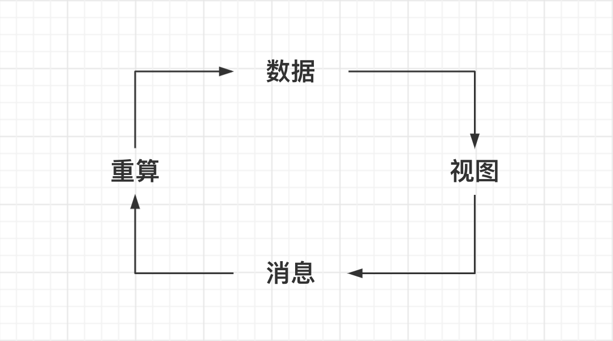
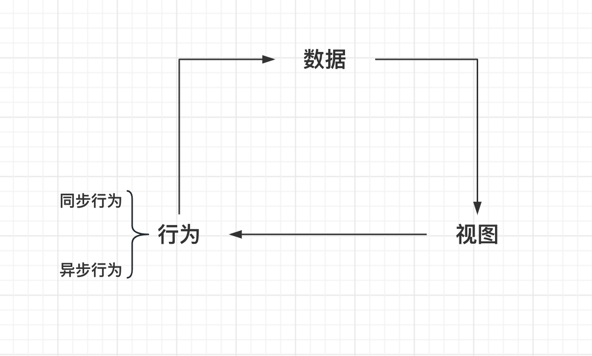
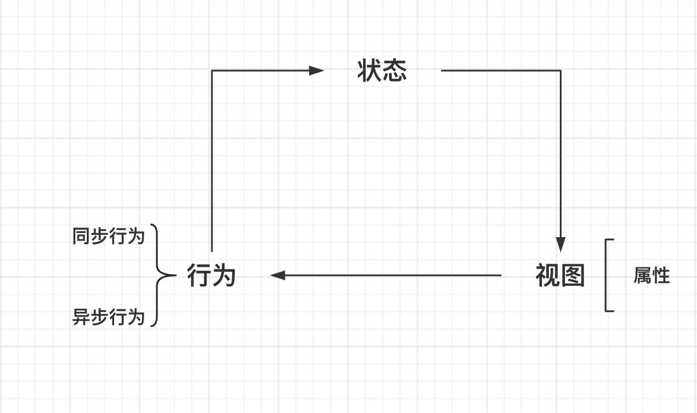
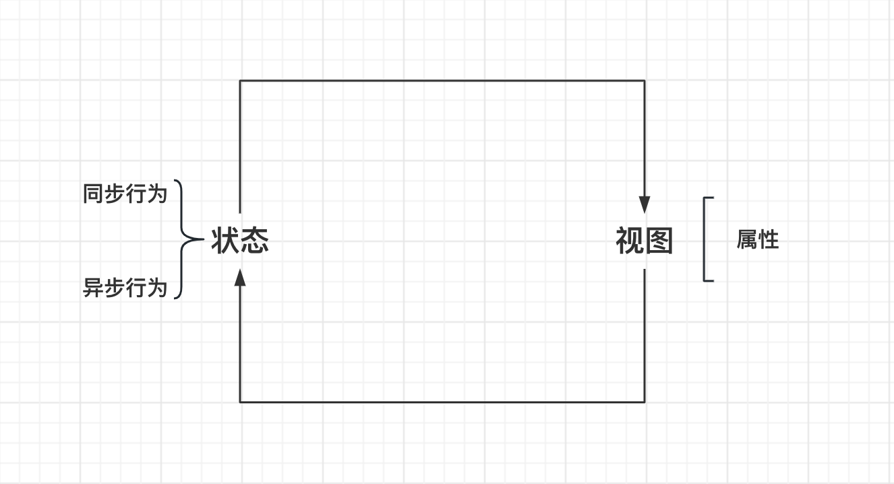
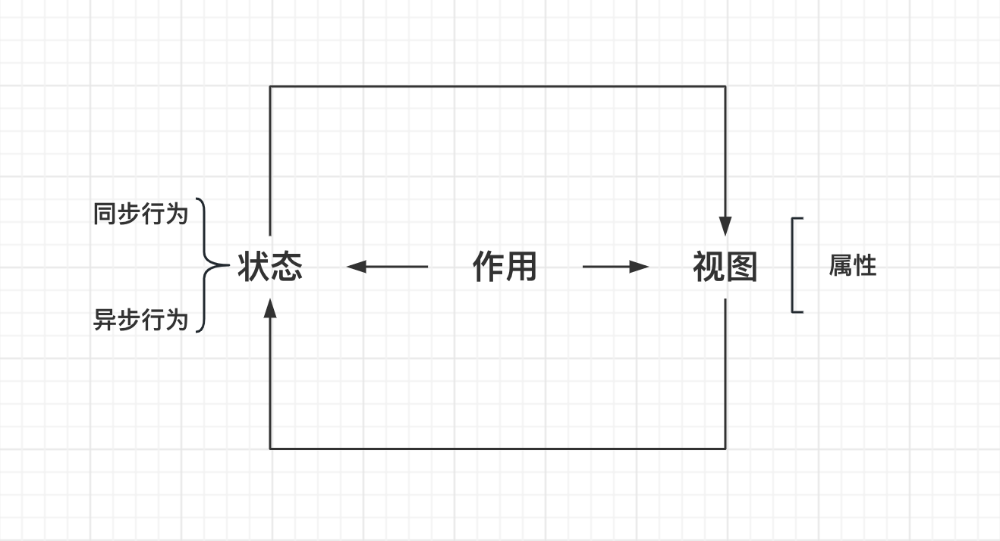
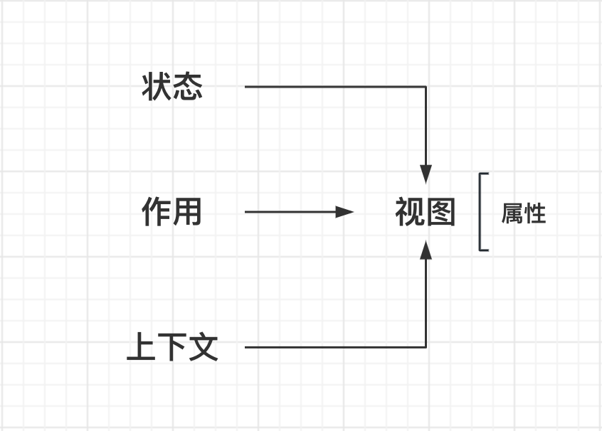

### UI 是什么？

`UI = f(data)`
函数 f 将数据 data 映射到用户界面得到 UI ，即「数据的映射」，是这样么？ No 。

#### 描述 UI

「数据」的存在使得「视图」得以描述，「视图」中存在交互，生成了「消息」，

「消息」引发了「数据」的「重算」，而「数据」的变化也导致了「视图」需要被重新渲染。

<center></center>

进 1 步抽象，可以将「消息」和「重算」合并为「行为」，

这里「行为」包括了「同步行为」和「异步行为」。

<center></center>

再进 1 步抽象，将数据进行拆分：不变的是「属性」，变化的是「状态」。

「状态」描述生成「视图」，「视图」中存在不变的「属性」，

「视图」中的交互触发「行为」，

「行为」改变了「状态」，

「状态」的更新使得「视图」需要重新渲染。

> 「状态」有一个隐含的意思，就是存在改变状态的行为（behavior）。
>
> 例如：点赞数（likes-状态）隐含了增加一个赞（addLike-行为），
> 而这个行为（点赞）只有在某个上下文中才会存在。

<center></center>

再进 1 步抽象，「状态」映射了「行为」，因此「行为」可以封装在「状态」内。

「状态」内部涵盖了「同步行为」和「异步行为」，
它的改变触发了「视图」的更新，

「视图」中存在不变的「属性」，
「视图」中包含的交互，触发了「同步或行为」，进 1 步改变了「状态」。

而「状态」可以分为「同步状态」和「异步状态」，

这里最典型的就是 Promise，Promise 用来描述一个即将发生的值。

「状态」也同样存在「未来的状态」，比如流，

文件流，数据流，视频流，流是 1 个未来的值，1 个未来可能发生的所有值的集合，

所以流看上去只是一个值，但它实际上包含了时间的关系。

可以理解为，「状态」可以包含住它的「行为」，而不让「视图」感知，「视图」只需要感知「状态」。

<center></center>

除开所有关于状态和视图的内容，项目中还存在另 1 个游离在其循环之外的东西，「作用」。

如 `console.log` ，如对交互行为进行上报，如用户的浏览器跳转。

「作用」需要一个上下文，这个上下文就是上面的循环。

> 比如用户的登录情况就是「状态」，「作用」根据这个「状态」决定是否要跳转到登录页，
> 这个跳转不是状态背后的行为，它是一个作用。

<center></center>

最终，变成了形形色色的概念如何与「视图」的关联。

> 这里，「状态」内包含了「行为」，「作用」本质上也是「行为」，「上下文」中也包含了「行为」。

<center></center>

这种关联我们希望可以做到松散的耦合，这样才可以复用。

这个关联的关系，称之为 hooks 。

### 什么是 hooks ？

UI 界面有哪些要素：

- state hook 状态行为；
- effect hook 作用行为；
- context hook 上下文行为；

`v = f(props, state)` ，v 就是视图，

所以 `UI = v + useHooks(state) + useHooks(effect) + useHooks(context)` 。

### React Hooks

#### 状态 hooks

- 在某个上下文中（用户界面）数据和改变数据的行为。

```js
// 例：计数器
import { useState } from "react";

function useCount(initValue) {
  const [count, setCount] = useState(initValue); // 这里可以把 hook 当做一个描述而非函数
  //     状态    行为        hooks api
  // react hooks 将数据与行为绑定。
  return [count, () => setCount((count) => count++)];
}

function example() {
  // 将数据与行为强关联，与UI弱关联
  // UI不再关注行为的具体细节，只需触发，并根据数据的改变绘制界面
  // 开发者无需在意UI的生成，只关注数据的改变
  const [count, addCount] = useCount(0); // 数据与行为一对一绑定，不建议将无关联的数据合并看待
  return (
    <>
      Your count: {count}
      <button onClick={addCount}>+</button>
    </>
  );
}
```

#### 作用 hooks

客观世界有 url 计时器 logger 开发者做不到完美而纯洁的视图渲染。

「作用」的存在用户不可感知，但现实存在。

`useEffect(fn, deps)` 是一个依赖 deps 变化的「作用」，

deps 选填，值是一个数组，

若 deps 不配置时，这个「作用」依赖变化执行，就是说每次组件重新渲染都会执行它，

若 deps 长度为 0 或者 数组内元素皆为常量时，这个「作用」只会在模块初始化时执行 1 次。

```js
// 例：
import { useEffect, useState } from "react";

// 这是一个定时器，只被执行 1 次，组件卸载时定时器也会被销毁。
function useInterval(callback, time) {
  useEffect(() => {
    const I = setInterval(callback, time);
    return () => {
      clearInterval(i);
    };
  }, []);
}

function someEffect(count) {
  console.log(count);
}

function example() {
  const [count, setCount] = useState(0);
  // 这里可以把 someEffect 看作1个描述
  // 每次组件更新，都会创建一个新 someEffect 并执行
  useEffect(someEffect.bind(null, count));
  // 在「作用」中使用「状态」时要保证依赖了它，否则这个「状态」值不会更新

  useInterval(() => {
    setCount((count) => count++);
  }, 1000);

  return (
    <>
      <p>Your clicked {count} times</p>
      <button onClick={() => setCount((count) => count++)}>Click me</button>
    </>
  );
}
```

##### 上下文 hooks

「上下文」就是理解事物时所需的背景知识。

有了「上下文」，组件的行为和它依赖的数据，就进行了解耦。

在 React 中，Context 完成了「上下文」的职责。

```js
// 例
import { useState, createContext, useContext } from "react";
const themes = {
  light: { background: "", foreground: "" },
  dark: { background: "", foreground: "" },
};

// 注册一个「上下文」
const ThemeContext = createContext({
  theme: themes.light,
  toggle: () => {},
});

export default () => {
  const [theme, setTheme] = useState(themes.light);
  return (
    // 创建一个「上下文」的提供者，这个提供者的 children 可以使用这个「上下文」。
    <ThemeContext.Provider
      // 给这个「上下文」赋值
      value={{
        theme,
        toggle: () => {
          setTheme((theme) =>
            theme === themes.light ? themes.dark : themes.light
          );
        },
      }}
    >
      <Toolbar />
    </ThemeContext.Provider>
  );
};

const Toolbar = () => {
  return <ThemedButton />;
};

const ThemedButton = () => {
  const context = useContext(ThemeContext); // 获取这个上下文的内容
  return <button
            style={{
                fontSize: '32px',
                color: context.theme.foreground,
                background: context.theme.background
            }}
            onClick=(() => {
                context.toggle();
            })
        >click me</button>;
};
```

#### 解压器 reducer

（设计模式）提供一种抽象状态行为的通用封装 action ，以及计算过程的抽象。

相当于给 1 个状态预设 了多个修改行为。

```js
function reducer(state, action) {
  switch (action.type) {
    case "add":
      return state++;
    case "sub":
      return state--;
  }
}
export default function Counter() {
  const [counter, dispatch] = useReducer(reducer, 0);
  return <div>
    Your counter is: {counter}
    <button onclick={() => dispatch({type: 'add'})}>+</buton>
    <button onclick={() => dispatch({type: 'sub'})}>-</buton>
  </div>
}
```

#### 引用行为 ref

引用 React 生命周期以外的对象。
需要在 React 之外做一些事情：例如 focus 、媒体对象操作、 canvas 等。

```js
import { useRef } from "react";
export default function UseRefExample() {
  const refInput = useRef(null);
  return (
    <div>
      <input ref={refInput} />
      <button onClick={() => refInput.current.focus()}>focus</button>
    </div>
  );
}
```

附带作用：可以方便的保存值。

#### 缓存

前端中的缓存主要用于存储 1 些经常会使用到且不会变更的数据，这里的数据还包括函数，甚至组件。

示例场景：

- `v = f(state, props) useHooks`
- 想在 f 中 new Object() 只创建 1 次，
- 1 些复杂的计算只有在状态改变后才能做，

```js
// 缓存 1 个值 useMemo
// 缓存 1 个函数 useCallback
import { useMemo, useCallback, useState } from "react";
const UseMemoExample = () => {
  const [count, setCount] = useState(0);
  const memorizedText = useMemo(() => {
    return `this is a memorized text ${Date.now()}`;
  }, []);
  const add = useCallback(() => setCount((count) => count++), []);

  return (
    <>
      {memorizedText}
      <p>You clicked {count} times</p>
      <button onClick={add}>click me</button>
    </>
  );
};
```

### 总结

**UI 是什么？**

UI 是 1 个函数，它将状态和属性映射到视图，

同时调用了 状态 hooks 作用 hooks 和 上下文 hooks ，这 1 系列 hooks 都是「行为」，

UI 就是「视图」+「行为」。

**hooks 解决了什么问题？**

hooks 抽象了「状态」「作用」和「上下文」，让这些「动作」更加语义化起来，

它方便了这些「动作」的复用和组合，

且让使用者无需关注上述「动作」的执行逻辑，只关注项目本身的逻辑。
