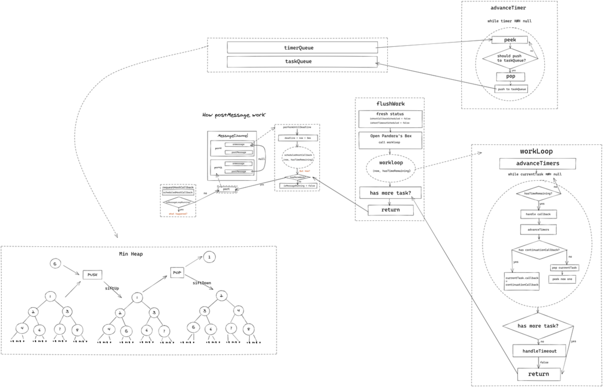

一次 **react** 更新，最核心的过程就是 **fiber tree** 的**协调**。通过**协调**，可以找到 **fiber tree** 中发生变化的 **fiber node**，最小程度的对页面的 **dom tree** 结构进行调整。

**react** 提供了两种模式：**Legacy mode** - **同步阻塞模式**和 **Concurrent mode** - **并行模式**。

这两种模式，区别在于 **fiber tree** 的**协调**过程是否**可中断**： Legacy mode 不可，Concurrent mode 可中断。

> React 提出当前构建更好的用户体验所面临的两个场景「计算密集型」和「I/O密集型」；  
> 
> React 中针对 vdom 的计算过程就是一个典型的「计算密集型」场景，它会因为节点过多等因素变成一个耗时的任务。而当 JS 引擎长时间执行其计算时，页面渲染就会暂停，带来糟糕的交互体验。

## Concurrent 模式

REACT18+ 且使用了如下几个 Hooks, 才会开启 Concurrent Features：

- `startTransition()`
- `useTransition()`
- `useDeferredValue()`

Concurrent 模式下「更新」动作是分片执行的，这样 React 就不会长时间占用 JS渲染线程，

同时引入了「更新优先级机制」，优先处理高优先级的更新，保证用户交互的更新被优先处理，保证了页面的持续响应。使用 Suspense、startTransition**、**useDeferredValue 等 API 将某些更新耗时比较大的组件标记为低优先级，它们在更新时就不会阻塞后续的高优先级更新，比如用户交互更新。

举个例子，一个超大的信息列表, 通过输入框输入内容来筛选展示列：

```js
// 不使用 concurrent features 时
import { FC, useState, ChangeEvent } from 'react'
import Box from '@mui/material/Box'
import Input from '@mui/material/Input'
import List from '@mui/material/List'
import ListItem from '@mui/material/ListItem'
import ListItemText from '@mui/material/ListItemText'
import Paper from '@mui/material/Paper'
import DATA from './data.json'

const ConcurrentFeature: FC = () => {
  const [data, setData] = useState(DATA)
  const handleFilter = (
    e: ChangeEvent<HTMLInputElement | HTMLTextAreaElement>
  ) => {
    const filteredData = DATA.filter((val) => val[0].includes(e.target.value))
    setData(filteredData)
  }
  return (
    <Box>
      <Input
        sx={{ marginBottom: 2, width: 400 }}
        onChange={(e) => handleFilter(e)}
      />

      <Paper>
        <List>
          {data.map(([a, b, c, d]) => (
            <ListItem key={a}>
              <ListItemText
                primary={
                  <span>
                    {a}; {b}; {c}; {d}
                  </span>
                }
              />
            </ListItem>
          ))}
        </List>
      </Paper>
    </Box>
  )
}

export default ConcurrentFeature
```

```js
// 使用 useDeferredValue
import {
  FC,
  useState,
  useDeferredValue,
  ChangeEvent,
  Suspense,
  useMemo
} from 'react'
import Box from '@mui/material/Box'
import Input from '@mui/material/Input'
import List from '@mui/material/List'
import ListItem from '@mui/material/ListItem'
import ListItemText from '@mui/material/ListItemText'
import Paper from '@mui/material/Paper'
import DATA from './data.json'

const ConcurrentFeature: FC = () => {
  const [data, setData] = useState(DATA)
  const deferred = useDeferredValue(data)
  const handleFilter = (
    e: ChangeEvent<HTMLInputElement | HTMLTextAreaElement>
  ) => {
    const filteredData = DATA.filter((val) => val[0].includes(e.target.value))
    setData(filteredData)
  }
  const filters = useMemo(
    () => (
      <List>
        {deferred.map(([a, b, c, d]) => (
          <ListItem key={a}>
            <ListItemText
              primary={
                <span>
                  {a}; {b}; {c}; {d}
                </span>
              }
            />
          </ListItem>
        ))}
      </List>
    ),
    [deferred]
  )
  return (
    <Box>
      <Input
        sx={{ marginBottom: 2, width: 400 }}
        onChange={(e) => handleFilter(e)}
      />
      <Paper>
        <Suspense fallback="Loading results...">{filters}</Suspense>
      </Paper>
    </Box>
  )
}

export default ConcurrentFeature
```

## Scheduler

Scheduler 是内置于 React 项目下的一个包, 只需要将任务以及任务的优先级交给它, 它就可以进行任务的协调调度。

Scheduler 从宏观和微观对任务进行管控，  
宏观上, 也就是对于多个任务, Scheduler 根据优先级来安排执行顺序；   
而对于单个任务(微观上), 需要"有节制"的执行. 把一个耗时的任务及时中断掉, 去执行更重要的任务(比如用户交互), 后续再执行该耗时任务。  

### 多个任务的管理

在 Scheduler 中, 任务被分成了两种: 未过期的任务和已过期的任务, 分别存储在 timerQueue 和 taskQueue 两个队列中。

通过将任务的开始时间(startTime) 和 当前时间(currentTime) 比较:
- 当 startTime > currentTime，说明未过期, 存到 timerQueue ；
- 当 startTime <= currentTime，说明已过期, 存到 taskQueue ；

即便是区分了 timerQueue 和 taskQueue ，但每个队列中的任务也是有不同优先级的，因此在入队时需要根据紧急程度将紧急的任务排在前面. 老版本的 React Scheduler 使用循环链表来串联；  
新版本使用小顶堆这个数据结构实现, 它在插入或者删除元素的时候, 通过"上浮"和"下沉"操作来使元素自动排序。需要注意的是，堆的元素存储在数组中，而非树状结构。

插入任务时，timerQueue 和 taskQueue 能保证元素是从小到大排序的。排序依据：
- timerQueue 中, 依据任务的开始时间(startTime)排序, 开始时间越早, 说明会越早开始, 开始时间小的排在前面. 任务进来的时候, 开始时间默认是当前时间, 如果进入调度的时候传了延迟时间, 开始时间则是当前时间与延迟时间的和；
- taskQueue 中, 依据任务的过期时间(expirationTime)排序, 过期时间越早, 说明越紧急, 过期时间小的排在前面. 过期时间根据任务优先级计算得出, 优先级越高, 过期时间越早；

任务的执行：
- 对于 taskQueue, 因为里面的任务已经过期了, 需要在 workLoop 中循环执行完这些任务；
- 对于 timerQueue, 它里面的任务都不会立即执行, 但在 workLoop 方法中会通过 advanceTimers 方法来检测第一个任务是否过期, 如果过期了, 就放到 taskQueue 中；

### 单个任务的中断及恢复

在循环 taskQueue 执行每一个任务时, 如果某个任务执行时间过长, 达到了时间片限制的时间, 那么该任务必须中断, 以便于让位给更重要的事情(如浏览器绘制), 等高优过期任务完成了, 再恢复执行该任务。  
Scheduler 要实现这样的调度效果需要两个角色: 任务的调度者, 任务的执行者。调度者调度一个执行者, 执行者去循环 taskQueue, 逐个执行任务. 当某个任务的执行时间比较长, 执行者会根据时间片中断任务执行, 然后告诉调度者: 我现在正执行的这个任务被中断了, 还有一部分没完成, 但现在必须让位给更重要的事情, 你再调度一个执行者吧, 好让这个任务能在之后被继续执行完(任务的恢复). 于是, 调度者知道了任务还没完成, 需要继续做, 它会再调度一个执行者去继续完成这个任务. 通过执行者和调度者的配合, 可以实现任务的中断和恢复. 其实将任务挂起与恢复并不是一个新潮的概念, 它有一个名词叫做协程, ES6 之后的生成器, 就可以用 yield 关键字来模拟协程的概念。



### React 和 Scheduler 的优先级转换

 React 的优先级采用的是 Lane 模型, 而 Scheduler 是一个独立的包, 有自己的一套优先级机制, 因此需要做一个转换。

 ```js
 let newCallbackNode;
// 同步
if (newCallbackPriority === SyncLane) {
  // 执行 scheduleSyncCallback 方法
  // 只不过要区分下 legacy 模式还是 concurrent 模式
  // scheduleSyncCallback 自己有个 syncQueue, 用来承载同步任务
  // 并交由 flushSyncCallbacks 处理这些同步任务后, 再交由下面 scheduleCallback
  // 以最高优先级让 Scheduler 调度
  if (root.tag === LegacyRoot) {
    scheduleLegacySyncCallback(performSyncWorkOnRoot.bind(null, root));
  } else {
    scheduleSyncCallback(performSyncWorkOnRoot.bind(null, root));
  }

  // 这里我们只谈 scheduleCallback, 即以最高优先级
  // ImmediateSchedulerPriority 来执行同步任务
  if (supportsMicrotasks) {
    scheduleMicrotask(flushSyncCallbacks);
  } else {
    scheduleCallback(ImmediateSchedulerPriority, flushSyncCallbacks);
  }
  newCallbackNode = null;
} else {
  // 异步
  let schedulerPriorityLevel;
  // 需要将 lane 转换为 Scheduler 可识别的优先级
  switch (lanesToEventPriority(nextLanes)) {
    case DiscreteEventPriority:
      schedulerPriorityLevel = ImmediateSchedulerPriority;
      break;
    case ContinuousEventPriority:
      schedulerPriorityLevel = UserBlockingSchedulerPriority;
      break;
    case DefaultEventPriority:
      schedulerPriorityLevel = NormalSchedulerPriority;
      break;
    case IdleEventPriority:
      schedulerPriorityLevel = IdleSchedulerPriority;
      break;
    default:
      schedulerPriorityLevel = NormalSchedulerPriority;
      break;
  }
  // 通过 scheduleCallback 将任务及其优先级传入到 Scheduler 中
  newCallbackNode = scheduleCallback(
    schedulerPriorityLevel,
    performConcurrentWorkOnRoot.bind(null, root)
  );
}
```

Scheduler 自身维护 6 种优先级，不过翻了一遍源码 NoPriority 没被用过。它们是计算 expirationTime 的重要依据， expirationTime 事关 taskQueue 的排序。

```js
export const NoPriority = 0; // 没有任何优先级
export const ImmediatePriority = 1; // 立即执行的优先级, 级别最高
export const UserBlockingPriority = 2; // 用户阻塞级别的优先级, 比如用户输入, 拖拽这些
export const NormalPriority = 3; // 正常的优先级
export const LowPriority = 4; // 低优先级
export const IdlePriority = 5; // 最低阶的优先级, 可以被闲置的那种
```

### 宏观

#### scheduleCallback

Scheduler 的主入口是 scheduleCallback, 它负责生成调度任务, 根据任务是否过期将任务放入 timerQueue 或 taskQueue, 然后触发调度行为, 让任务进入调度. 注意: enableProfiling 用来做一些审计和 debugger, 本文不去涉及。
1. 首先计算 startTime, 它被用作 timerQueue 排序的依据, getCurrentTime() 用来获取当前时间, 下面会讲到；
2. 接着计算 expirationTime, 它被用作 taskQueue 排序的依据, 过期时间通过传入的优先级确定；
3. newTask 是 Scheduler 中任务单元的数据结构, 注释写的很清楚, 其中 sortIndex 是优先队列(小顶堆)中排序的依据；
4. 根据上面三步的铺垫, 这一步就是根据 startTime 和 currentTime 的关系将任务放到 timerQueue 或 taskQueue 之中, 然后触发调度行为；

```js
function unstable_scheduleCallback(priorityLevel, callback, options) {
  /*
   * (1
   */
  var currentTime = getCurrentTime();
  // timerQueue 根据 startTime 排序
  // 任务进来的时候, 开始时间默认是当前时间, 如果进入调度的时候传了延迟时间
  // 开始时间则是当前时间与延迟时间的和
  var startTime;
  if (typeof options === "object" && options !== null) {
    var delay = options.delay;
    if (typeof delay === "number" && delay > 0) {
      startTime = currentTime + delay;
    } else {
      startTime = currentTime;
    }
  } else {
    startTime = currentTime;
  }

  /*
   * (2
   */
  // taskQueue 根据 expirationTime 排序
  var timeout;
  switch (priorityLevel) {
    case ImmediatePriority:
      timeout = IMMEDIATE_PRIORITY_TIMEOUT; // -1
      break;
    case UserBlockingPriority:
      timeout = USER_BLOCKING_PRIORITY_TIMEOUT; // 250
      break;
    case IdlePriority:
      timeout = IDLE_PRIORITY_TIMEOUT; // 1073741823 (2^30 - 1)
      break;
    case LowPriority:
      timeout = LOW_PRIORITY_TIMEOUT; // 10000
      break;
    case NormalPriority:
    default:
      timeout = NORMAL_PRIORITY_TIMEOUT; // 5000
      break;
  }

  // 计算任务的过期时间, 任务开始时间 + timeout
  // 若是立即执行的优先级(IMMEDIATE_PRIORITY_TIMEOUT(-1))
  // 它的过期时间是 startTime - 1, 意味着立刻就过期
  var expirationTime = startTime + timeout;
  /*
   * (3
   */
  // 创建调度任务
  var newTask = {
    id: taskIdCounter++,
    callback, // 调度的任务
    priorityLevel, // 任务优先级
    startTime, // 任务开始的时间, 表示任务何时才能执行
    expirationTime, // 任务的过期时间
    sortIndex: -1, // 在小顶堆队列中排序的依据
  };

  if (enableProfiling) {
    newTask.isQueued = false;
  }

  /*
   * (4
   */
  // startTime > currentTime 说明任务无需立刻执行
  // 故放到 timerQueue 中
  if (startTime > currentTime) {
    // timerQueue 是通过 startTime 判断优先级的,
    // 故将 startTime 设为 sortIndex 作为优先级依据
    newTask.sortIndex = startTime;
    push(timerQueue, newTask);

    // 如果 taskQueue 是空的, 并且当前任务优先级最高
    // 那么这个任务就应该优先被设为 isHostTimeoutScheduled
    if (peek(taskQueue) === null && newTask === peek(timerQueue)) {
      // 如果超时调度已经在执行了, 就取消掉
      // 这是为了保证只运行一个 setTimeout
      if (isHostTimeoutScheduled) {
        cancelHostTimeout();
      } else {
        isHostTimeoutScheduled = true;
      }
      // Schedule a timeout.
      requestHostTimeout(handleTimeout, startTime - currentTime);
    }
  } else {
    // startTime <= currentTime 说明任务已过期
    // 需将任务放到 taskQueue
    newTask.sortIndex = expirationTime;
    push(taskQueue, newTask);

    if (enableProfiling) {
      markTaskStart(newTask, currentTime);
      newTask.isQueued = true;
    }

    // 如果目前正在对某个过期任务进行调度,
    // 当前任务需要等待下次时间片让出时才能执行
    if (!isHostCallbackScheduled && !isPerformingWork) {
      isHostCallbackScheduled = true;
      requestHostCallback(flushWork);
    }
  }

  return newTask;
}
```

#### getCurrentTime

顾名思义, getCurrentTime 用来获取当前时间, 它优先使用 performance.now(), 否则使用 Date.now(). 提起 performance 我们并不陌生, 它主要被用来收集性能指标. performance.now() 返回一个精确到毫秒的 DOMHighResTimeStamp 。

```js
let getCurrentTime;
const hasPerformanceNow =
  typeof performance === "object" && typeof performance.now === "function";
if (hasPerformanceNow) {
  const localPerformance = performance;
  getCurrentTime = () => localPerformance.now();
} else {
  const localDate = Date;
  const initialTime = localDate.now();
  getCurrentTime = () => localDate.now() - initialTime;
}
```

#### requestHostTimeout 和 cancelHostTimeout

显然这是一对相反的方法。为了让一个未过期的任务能够到达恰好过期的状态, 那么需要延迟 startTime - currentTime 毫秒就可以了(其实它俩的差就是 XXX_PRIORITY_TIMEOUT), requestHostTimeout 就是来做这件事的, 而 cancelHostTimeout 就是用来取消这个超时函数的。

```js
function requestHostTimeout(callback, ms) {
  taskTimeoutID = setTimeout(() => {
    callback(getCurrentTime());
  }, ms);
}

function cancelHostTimeout() {
  clearTimeout(taskTimeoutID);
  taskTimeoutID = -1;
}
```

#### handleTimeout

requestHostTimeout 的第一个参数 callback, 实际执行的是 handleTimeout 函数. 首先调用了 advanceTimers 方法, 这个方法下面具体说. 接下来如果没有正在调度任务, 就看看 taskQueue 中是否存在任务, 如果有的话就先 flush 掉; 否则就递归执行 requestHostTimeout(handleTimeout, ...). 总之来讲, 这个方法就是要把 timerQueue 中的任务转移到 taskQueue 中。

```js
function handleTimeout(currentTime) {
  isHostTimeoutScheduled = false;
  // 更新 timerQueue 和 taskQueue 两个序列
  // 如果发现 timerQueue 有过期的, 就放到 taskQueue 中
  advanceTimers(currentTime);

  // 检查是否已经开始调度
  // 如果正在调度, 就什么都不做
  if (!isHostCallbackScheduled) {
    // 如果 taskQueue 中有任务, 那就先去执行已过期的任务
    if (peek(taskQueue) !== null) {
      isHostCallbackScheduled = true;
      requestHostCallback(flushWork);
    } else {
      // 如果没有过期任务, 那就把最高优的超时任务放到 requestHostTimeout
      // 直到它可以被放置到 taskQueue
      const firstTimer = peek(timerQueue);
      if (firstTimer !== null) {
        requestHostTimeout(handleTimeout, firstTimer.startTime - currentTime);
      }
    }
  }
}
```

#### advanceTimers

这个方法就是用来检查 timerQueue 中的是否有过期任务, 有的话放到 taskQueue. 主要是对小顶堆的各种操作, 直接看注释即可。

```js
function advanceTimers(currentTime) {
  let timer = peek(timerQueue);
  while (timer !== null) {
    if (timer.callback === null) {
      // Timer was cancelled.
      pop(timerQueue);

      // 开始时间小于等于当前时间, 说明已过期,
      // 从 taskQueue 移走, 放到 taskQueue
    } else if (timer.startTime <= currentTime) {
      pop(timerQueue);
      // taskQueue 是通过 expirationTime 判断优先级的,
      // expirationTime 越小, 说明越紧急, 它就应该放在 taskQueue 的最前面
      timer.sortIndex = timer.expirationTime;
      push(taskQueue, timer);

      if (enableProfiling) {
        markTaskStart(timer, currentTime);
        timer.isQueued = true;
      }
    } else {
      // 开始时间大于当前时间, 说明未过期, 任务仍然保留在 timerQueue
      // 任务进来的时候, 开始时间默认是当前时间, 如果进入调度的时候传了延迟时间, 开始时间则是当前时间与延迟时间的和
      // 开始时间越早, 说明会越早开始, 排在最小堆的前面
      // Remaining timers are pending.
      return;
    }
    timer = peek(timerQueue);
  }
}
```

### 微观

#### 使用 MessageChannel 实现调度

时间切片, 任务中断可恢复这些动作，既然是"调度", 必然要有指挥的和干活的。

旧的 React 版通过 requestAnimationFrame 和 requestIdleCallback 进行任务调度与帧对齐。后期 rAF 这个方式被废弃掉了，  

> 另外，rAF 是会受到用户行为的干扰的, 比如切换选项卡, 滚动页面等，帧刷新率并不稳定，  
> 且 rAF 与显示器的刷新频率强关联, 而市面上的刷新频率参差不齐, 有 60Hz 的, 像苹果的 ProMotion 就到了 120Hz. 简言之, rAF 会受到外界因素影响, 无法使 Scheduler 做到百分百掌控。

目前, Scheduler 通过 MessageChannel 来人为的控制调度频率, 默认的时间切片是 5ms ，  
如果是 Node.js 或者低端 IE, 就使用 setImmediate 。

```js
let schedulePerformWorkUntilDeadline;
if (typeof setImmediate === "function") {
  schedulePerformWorkUntilDeadline = () => {
    setImmediate(performWorkUntilDeadline);
  };
} else {
  const channel = new MessageChannel();
  const port = channel.port2;
  // port1 接收调度信号, 来执行 performWorkUntilDeadline
  channel.port1.onmessage = performWorkUntilDeadline;

  // port 是调度者
  schedulePerformWorkUntilDeadline = () => {
    port.postMessage(null);
  };
}
```

#### requestHostCallback

requestHostCallback 将传进来的 callback 赋值给全局变量 scheduledHostCallback, 如果当前 isMessageLoopRunning 是 false, 即没有任务调度, 就把它开启, 然后发送调度信号给 port1 进行调度。

```js
function requestHostCallback(callback) {
  scheduledHostCallback = callback;
  if (!isMessageLoopRunning) {
    isMessageLoopRunning = true;
    // postMessage, 告诉 port1 来执行 performWorkUntilDeadline 方法
    schedulePerformWorkUntilDeadline();
  }
}
```

#### performWorkUntilDeadline

performWorkUntilDeadline 是任务的执行者, 也就是 port1 接收到信号后需要执行的函数, 它用来在时间片内执行任务, 如果没执行完, 用一个新的调度者继续调度. 首先判断是否有 scheduledHostCallback, 如果存在说明存在需要被调度的任务. 计算 deadline 为当前时间加上 yieldInterval(也就是那 5ms). 看到这里相必你就恍然大悟了, deadline 其实就来做时间切片! 接下来设置了一个常量 hasTimeRemaining 为 true, 看到这俩名字你是不是想起了 requestIdleCallback 的用法了呢. 至于为什么 hasTimeRemaining 为 true, 因为不管你的整个任务是否执行完, 给你的时间就是 5ms, 要么超时就中断, 要么不超时就恰好执行完了, 总之时间切片内一定是有剩余时间的。
后面的逻辑直接看代码注释即可, 总结来讲就是任务在时间切片内没有被执行完, 就需要让调度者再次调度一个执行者继续执行任务, 否则这个任务就算执行完了。

```js
const performWorkUntilDeadline = () => {
  if (scheduledHostCallback !== null) {
    const currentTime = getCurrentTime();
    // 时间分片
    deadline = currentTime + yieldInterval;
    const hasTimeRemaining = true;
    let hasMoreWork = true;
    try {
      // scheduledHostCallback 去执行真正的任务
      // 如果返回 true, 说明当前任务被中断了
      // 会再让调度者调度一个执行者继续执行任务
      // 下面讲 workLoop 方法时会说到中断恢复的逻辑, 先留个坑
      hasMoreWork = scheduledHostCallback(hasTimeRemaining, currentTime);
    } finally {
      if (hasMoreWork) {
        // 如果任务中断了(没执行完), 就说明 hasMoreWork 为 true
        // 这块类似于递归, 就再申请一个调度者来继续执行该任务
        schedulePerformWorkUntilDeadline();
      } else {
        // 否则当前任务就执行完了
        // 关闭 isMessageLoopRunning
        // 并将 scheduledHostCallback 置为 null
        isMessageLoopRunning = false;
        scheduledHostCallback = null;
      }
    }
  } else {
    isMessageLoopRunning = false;
  }
  // Yielding to the browser will give it a chance to paint, so we can
  // reset this.
  needsPaint = false;
};
```

#### flushWork

在 requestHostCallback 就将 flushWork 作为参数赋值给了全局变量 scheduledHostCallback, 在上面 performWorkUntilDeadline 也调用了该方法，flushWork 就是把任务"冲刷"掉. 当然剖丝抽茧, 该方法的核心就是 return 了 workLoop。

```js
function flushWork(hasTimeRemaining, initialTime) {
  if (enableProfiling) {
    markSchedulerUnsuspended(initialTime);
  }

  // 由于 requestHostCallback 并不一定立即执行传入的回调函数
  // 所以 isHostCallbackScheduled 状态可能会维持一段时间
  // 等到 flushWork 开始处理任务时, 则需要释放该状态以支持其他的任务被 schedule 进来
  isHostCallbackScheduled = false;
  // 因为已经在执行 taskQueue 的任务了
  // 所以不需要等 timerQueue 中的任务过期了
  if (isHostTimeoutScheduled) {
    isHostTimeoutScheduled = false;
    cancelHostTimeout();
  }

  isPerformingWork = true;
  const previousPriorityLevel = currentPriorityLevel;
  try {
    if (enableProfiling) {
      try {
        return workLoop(hasTimeRemaining, initialTime);
      } catch (error) {
        if (currentTask !== null) {
          const currentTime = getCurrentTime();
          markTaskErrored(currentTask, currentTime);
          currentTask.isQueued = false;
        }
        throw error;
      }
    } else {
      // No catch in prod code path.
      return workLoop(hasTimeRemaining, initialTime);
    }
  } finally {
    // 执行完任务后还原这些全局状态
    currentTask = null;
    currentPriorityLevel = previousPriorityLevel;
    isPerformingWork = false;
    if (enableProfiling) {
      const currentTime = getCurrentTime();
      markSchedulerSuspended(currentTime);
    }
  }
}
```

#### 任务中断与恢复 —— workLoop

workLoop 可谓是集大成者, 承载了任务中断, 任务恢复, 判断任务完成等功能.
- 循环 taskQueue 执行任务
- 任务状态的判断
  - 如果 taskQueue 执行完成了, 就返回 false, 并从 timerQueue 中拿出最高优的来做超时调度
  - 如果未执行完, 说明当前调度发生了中断, 就返回 true, 下次接着调度(这个 Boolean 类型的返回值, 其实就对应着 performWorkUntilDeadline 中的 hasMoreWork)

```js
function workLoop(hasTimeRemaining, initialTime) {
  let currentTime = initialTime;
  // 因为是个异步的, 需要再次调整一下 timerQueue 跟 taskQueue
  advanceTimers(currentTime);

  // 最紧急的过期任务
  currentTask = peek(taskQueue);
  while (
    currentTask !== null &&
    !(enableSchedulerDebugging && isSchedulerPaused) // 用于 debugger, 不管
  ) {
    // 任务中断!!!
    // 时间片到了, 但当前任务未过期, 跳出循环
    // 当前任务就被中断了, 需要放到下次 workLoop 中执行
    if (
      currentTask.expirationTime > currentTime &&
      (!hasTimeRemaining || shouldYieldToHost())
    ) {
      // This currentTask hasn't expired, and we've reached the deadline.
      break;
    }

    const callback = currentTask.callback;
    if (typeof callback === "function") {
      // 清除掉 currentTask.callback
      // 如果下次迭代 callback 为空, 说明任务执行完了
      currentTask.callback = null;

      currentPriorityLevel = currentTask.priorityLevel;

      // 已过期
      const didUserCallbackTimeout = currentTask.expirationTime <= currentTime;
      if (enableProfiling) {
        markTaskRun(currentTask, currentTime);
      }

      // 执行任务
      const continuationCallback = callback(didUserCallbackTimeout);
      currentTime = getCurrentTime();

      // 如果产生了连续回调, 说明出现了中断
      // 故将新的 continuationCallback 赋值 currentTask.callback
      // 这样下次恢复任务时, callback 就接上趟了
      if (typeof continuationCallback === "function") {
        currentTask.callback = continuationCallback;

        if (enableProfiling) {
          markTaskYield(currentTask, currentTime);
        }
      } else {
        if (enableProfiling) {
          markTaskCompleted(currentTask, currentTime);
          currentTask.isQueued = false;
        }
        // 如果 continuationCallback 不是 Function 类型, 说明任务完成!!!
        // 否则, 说明这个任务执行完了, 可以被弹出了
        if (currentTask === peek(taskQueue)) {
          pop(taskQueue);
        }
      }

      // 上面执行任务会消耗一些时间, 再次重新更新两个队列
      advanceTimers(currentTime);
    } else {
      // 上面的 if 清空了 currentTask.callback, 所以
      // 如果 callback 为空, 说明这个任务就执行完了, 可以被弹出了
      pop(taskQueue);
    }

    // 如果当前任务执行完了, 那么就把下一个最高优的任务拿出来执行, 直到清空了 taskQueue
    // 如果当前任务没执行完, currentTask 实际还是当前的任务, 只不过 callback 变成了 continuationCallback
    currentTask = peek(taskQueue);
  }

  // 任务恢复!!!
  // 上面说到 ddl 到了, 但 taskQueue 还没执行完(也就是任务被中断了)
  // 就返回 true, 这就是恢复任务的标志
  if (currentTask !== null) {
    return true;
  } else {
    // 在上面 flushWork 中, 如果一个任务执行完, 会将 currentTask 设为 null
    // 即任务完成!!!, 此时去 timerQueue 中找需要最早开始执行的那个任务
    // 进行 requestHostTimeout 调度那一套
    const firstTimer = peek(timerQueue);
    if (firstTimer !== null) {
      requestHostTimeout(handleTimeout, firstTimer.startTime - currentTime);
    }
    return false;
  }
}
```

#### 自定义的时间切片频率

为了后续 Scheduler 独立成包, 它开放了设置时间切片的大小, 默认为 5ms, 可以根据实际情况调整到 0 ~ 125 之间。

```js
function forceFrameRate(fps) {
  if (fps < 0 || fps > 125) {
    // Using console['error'] to evade Babel and ESLint
    console["error"](
      "forceFrameRate takes a positive int between 0 and 125, " +
        "forcing frame rates higher than 125 fps is not supported"
    );
    return;
  }
  if (fps > 0) {
    yieldInterval = Math.floor(1000 / fps);
  } else {
    // reset the framerate
    yieldInterval = 5;
  }
}
```

