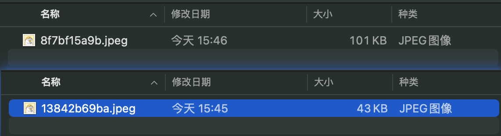
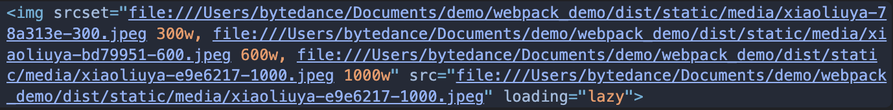

图像在 web 项目中几乎是必备资源类型，且针对图像资源的优化也是项目的必备需求。

### 图像支持

早期 Webpack 并不原生支持处理图像资源，需要安装 Loader 处理转译：

1. file-loader：将图像引用转换为 url 语句并生成对应的图片文件，经过处理后文件会被按规则重命名；
2. url-loader：相似，对于小于阈值 limit 的图像直接转换为 base64 编码内嵌到 bundle 中，反之调用 file-loader ；
3. raw-loader：不做任何转译，直接将文件内容复制到 bundle ；

> 提示：除 raw-loader 外，我们还可以使用如下 Loader 加载 SVG 资源：
>
> 1. svg-inline-loader：能够自动删除 SVG 图片中与显式无关的各种原信息，达到压缩效果；
> 2. svg-url-loader：以 DataURL 方式导入 SVG 图片，相比于 Base64 更节省空间；
> 3. react-svg-loader：导入 SVG 图片并自动转化为 React 组件形态，效果类似 @svgr/webpack；
> 4. vue-svg-loader：导入 SVG 图片并自动转化为 Vue 组件形态。

<br>

上述 Loader 并不局限于处理图像，使用频率极高，所以 Webpack5 内置了这些能力，

通过 `module.rule.type` 指定资源类型即可：

- file-loader 对标到 `type = "asset/resource"`

```js
// webpack.config.js
module.exports = {
  module: {
    rules: [
      {
        test: /\.(png|jpg)$/,
        type: "asset/resource",
        generator: {
          filename: "static/image/[hash:10][ext][query]", // 设定输出目录和资源命名规则
        },
      },
    ],
  },
};
```

- url-loader 对标到 `type = "asset`" 或 `type = "asset/inline"`

```js
// webpack.config.js
module.exports = {
  module: {
    rules: [
      {
        test: /\.(png|jpg)$/,
        type: "asset",
        parser: {
          dataUrlCondition: {
            maxSize: 1024, // 阈值，对标 url-loader 的 limit
          },
        },
      },
    ],
  },
};
```

- raw-loader 对标到 `type = "asset/source"`

```js
// webpack.config.js
module.exports = {
  module: {
    rules: [
      {
        test: /\.svg$/i,
        type: "asset/source",
      },
    ],
  },
};
```

<br>

<small>
<font color=#999>
引入 module.rules.type 并不只是为了取代 Loader 那么简单，
更重要的目的是在 JavaScript Module 之外增加对其它资源的原生支持，
让 Webpack 有机会介入这些多媒体资源的解析、生成过程，从而有机会实现更标准、高效的资源处理模型。
</font>
</small>

目前 module.rules.type 已经支持 JSON、WebAssemsbly、二进制、文本等资源类型。

### 图像压缩

Web 页面中针对图片做各种优化动作很多：

1. 图像压缩：减少网络上需要传输的流量；
2. 雪碧图：减少 HTTP 请求次数；
3. 响应式图片：根据客户端设备情况下发适当分辨率的图片，有助于减少网络流量；
4. CDN：减少客户端到服务器之间的物理链路长度，提升传输效率
5. ...

有些动作可以在构建阶段借助 Webpack 搭建自动优化工作流时完成，例如：图像压缩。

（图像压缩是一种非常耗时的操作，建议只在生产环境下开启。）

```yml
# 类似功能的 Loader 有很多
npm i image-webpack-loader -D
```

```js
module.exports = {
  module: {
    rules: [
        {
            test: /\.(png|jpeg|gif)$/i,
            type: 'asset',
            generator: {
                filename: "static/image/[hash:10][ext][query]" 
            },
            use: [
                'image-webpack-loader'
            ]
        },
    ]
  }
}
```

```yml
# 执行打包，得到压缩后图像资源
npx webpack
```



<br>

image-webpack-loader 底层依赖于 imagemin 及一系列的图像优化工具：

- mozjpeg：用于压缩 JPG(JPEG) 图片；
- optipng：用于压缩 PNG 图片；
- pngquant：同样用于压缩 PNG 图片；
- svgo：用于压缩 SVG 图片；
- gifsicle：用于压缩 Gif 图；
- webp：用于将 JPG/PNG 图压缩并转化为 WebP 图片格式。

```js
// webpack.config.js
module.exports = {
    module: {
        rules: [
            {
                test: /\.(png|jpeg|gif)$/i,
                type: 'asset',
                use: [
                    {
                        loader: 'image-webpack-loader',
                        options: {
                            disable: process.env.NODE_ENV === 'development',  // 图像压缩是一种耗时操作，建议只在生产环境下开启
                            // jpeg 压缩配置
                            mozjpeg: {
                                quality: 80
                            },
                        }
                    }
                ]
            }
        ],
    },
};
```

### 响应式图片

移动互联网时代客户端设备屏幕尺寸差距极大，为不同设备提供不同的分辨率、不同尺寸的图片 —— 也就是所谓的响应式图片  —— 是多端项目优化的一个重点。

```yml
#
npm i responsive-loader sharp -D
```

```js
// webpack.config.js
module.exports = {
    module: {
        rules: [
            {
                test: /\.(png|jpg)$/,
                oneOf: [{
                    type: "javascript/auto",
                    resourceQuery: /sizes?/,    // 过滤出需要被自适应的图像资源，通常没必要对项目里所有图片都施加响应式特性
                    use: [{
                        loader: "responsive-loader",
                        options: {
                            adapter: require("responsive-loader/sharp"),  
                            name: 'static/media/[name]-[hash:7]-[width].[ext]',  // 定义路径 命名规则
                        },
                    }],
                }, {
                    type: "asset/resource",
                }],
            }
        ],
    }
};
```

```js
import xiaoliuya from './assets/xiaoliuya.jpeg?sizes[]=300,sizes[]=600,sizes[]=1000'

const imageNode = document.createElement('IMG')
imageNode.setAttribute('srcSet', xiaoliuya.srcSet)
imageNode.setAttribute('src', xiaoliuya.src)
imageNode.setAttribute('loading', 'lazy')

document.body.append(imageNode)
```

```yml
# 执行打包，得到自适应img节点
npx webpack
```

