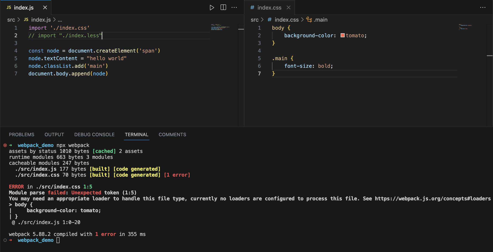
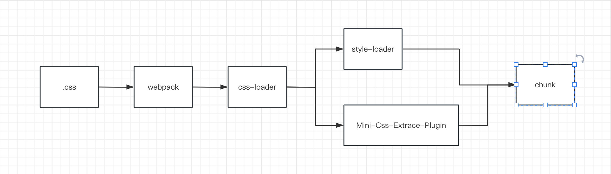
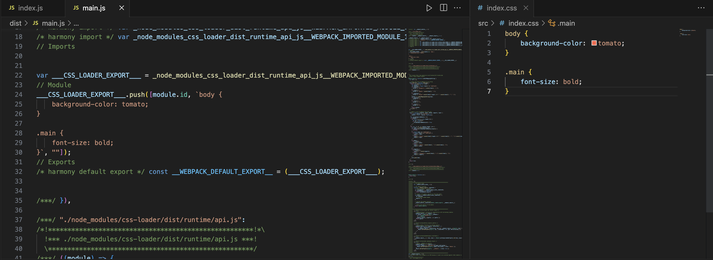
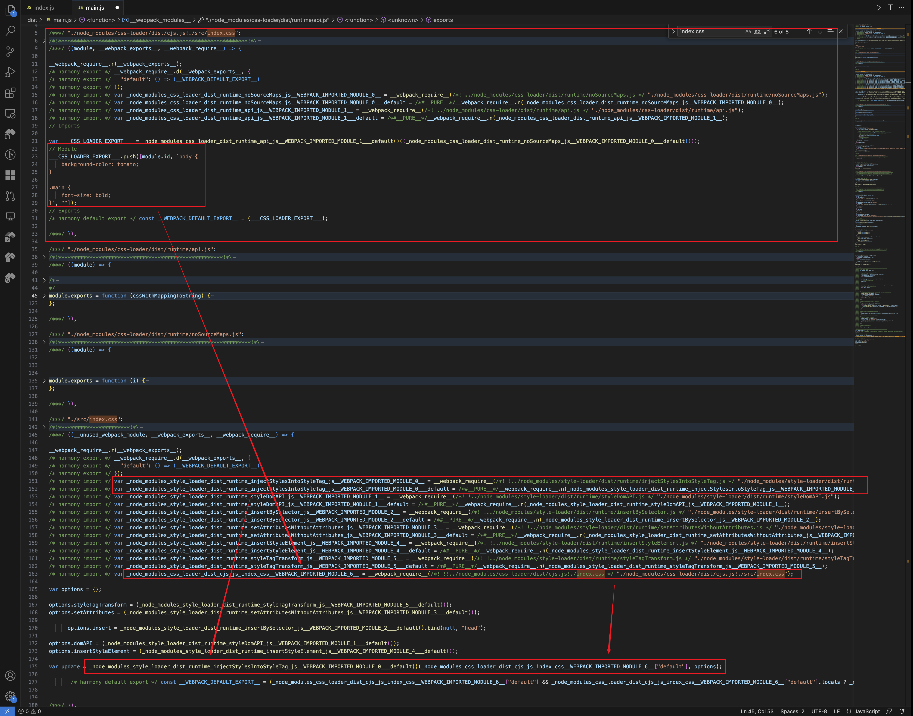
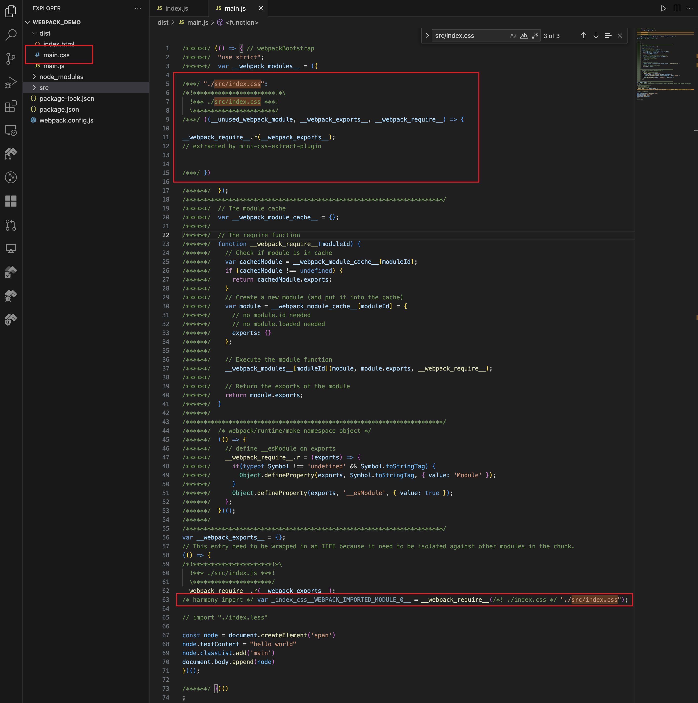
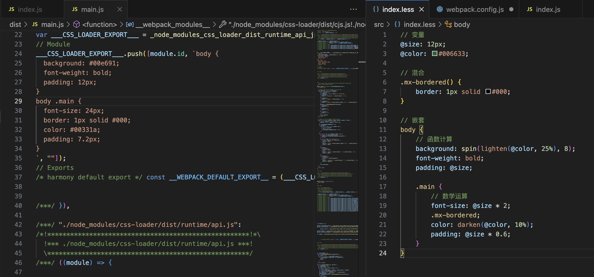
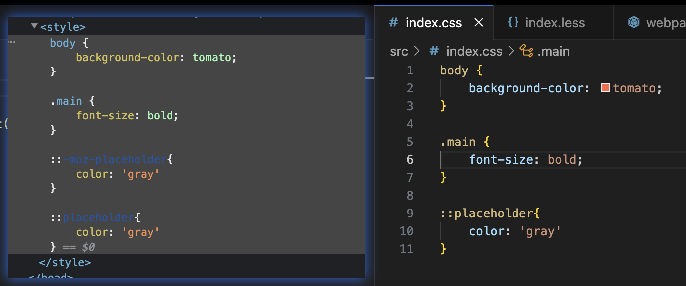

### 处理 CSS 资源

原生 Webpack 并不能识别 CSS 语法，做额外配置直接导入 .css 文件，会导致编译失败。



```yml
npm i css-loader style-loader mini-css-extract-plugin -D
```

1. **css-loader**：该 Loader 会将 CSS 等价翻译为形如 `module.exports = "${css}"` 的 JavaScript 代码，使得 Webpack 能够如同处理 JS 代码一样解析 CSS 内容与资源依赖；
2. **style-loader**：该 Loader 将在产物中注入一系列 runtime 代码，这些代码会将 CSS 内容注入到页面的 `<style>` ，使得样式生效；
3. **mini-css-extract-plugin**：该插件会将 CSS 代码抽离到单独的 .css 文件，并将文件通过 `<link>` 插入到页面中。

三种组件各司其职：css-loader 让 Webpack 能够正确理解 CSS 代码、分析资源依赖；style-loader、mini-css-extract-plugin 则通过适当方式将 CSS 插入到页面，对页面样式产生影响。

<br>

<center></center>

<br>

```js
// css-loader 提供了很多处理 CSS 代码的基础能力，
// 包括 CSS 到 JS 转译、依赖解析、Sourcemap、css-in-module 等，
// 基于这些能力，Webpack 才能像处理 JS 模块一样处理 CSS 模块代码。
// webpack.config.js
module.exports = {
  module: {
    rules: [
      {
        test: /\.css$/i,
        use: ["css-loader"],
      },
    ],
  },
};
```



但这段字符串只是被当作普通 JS 模块处理，并不会实际插入到页面中。

<br>

**1. 开发环境：使用 style-loader 将样式代码注入到页面 `<style>`**

```js
// style-loader 并不会对代码内容做任何修改，
// 而是简单注入一系列运行时代码，用于将 css-loader 转译出的 JS 字符串插入到页面的 style 标签。
// webpack.config.js
module.exports = {
  module: {
    rules: [
      {
        test: /\.css$/i,
        use: ["style-loader", "css-loader"],
      },
    ],
  },
};
```

```yml
# 执行
npx webpack
```

得到打包结果：


简化 1 下：
```js
// Part1: css-loader 处理结果，对标到原始 CSS 代码
const __WEBPACK_DEFAULT_EXPORT__ = (
"body {\n    background: yellow;\n    font-weight: bold;\n}"
);
// Part2: style-loader 处理结果，将 CSS 代码注入到 `style` 标签
injectStylesIntoStyleTag(
 __WEBPACK_DEFAULT_EXPORT__
)
```

运行页面触发 `injectStylesIntoStyleTag` 函数将 CSS 代码注入到 `<style>` ，样式才真正开始生效。

经过 style-loader + css-loader 处理后，样式代码最终会被写入 Bundle 文件，并在运行时通过 style 标签注入到页面。这种将 JS、CSS 代码合并进同一个产物文件的方式有几个问题：

- JS、CSS 资源无法并行加载，从而降低页面性能；
- 资源缓存粒度变大，JS、CSS 任意一种变更都会致使缓存失效。

<br>

**2. 生产环境：使用 mini-css-extract-plugin 将样式代码抽离成单独的 CSS 文件**

```js
const MiniCssExtractPlugin = require('mini-css-extract-plugin')
const HTMLWebpackPlugin = require('html-webpack-plugin')

module.exports = {
    module: {
        rules: [{
            test: /\.css$/,
            use: [
                // 根据运行环境判断使用那个 loader
                (process.env.NODE_ENV === 'development' ?
                    'style-loader' :
                    MiniCssExtractPlugin.loader),
                'css-loader'
            ]
        }]
    },
    plugins: [
        new MiniCssExtractPlugin(),
        new HTMLWebpackPlugin()
    ]
}
```

```yml
# 执行，得到下面打包结果
npx webpack
```



样式代码会被抽离到单独的 CSS 文件，并且在最终生成的 html 中包含了指向 JS、CSS 两种资源的标签：
```html
<script defer src="main.js"></script>
<link href="main.css" rel="stylesheet">
```
这里需要注意几个点：

- mini-css-extract-plugin 库同时提供 Loader、Plugin 组件，需要同时使用；
- mini-css-extract-plugin 不能与 style-loader 混用，否则报错，所以上述示例中第 9 行需要判断 process.env.NODE_ENV 环境变量决定使用那个 Loader ；
- mini-css-extract-plugin 需要与 html-webpack-plugin 同时使用，才能将产物路径以 link 标签方式插入到 html 中；

### 使用预处理器

CSS 语言在过去若干年中一直在追求样式表现力方面的提升，工程化能力薄弱，例如缺乏成熟的模块化机制、依赖处理能力、逻辑判断能力等。为此，在开发现代大型 Web 应用时，通常会使用 Webpack 配合其它预处理器编写样式代码。

在 Webpack 中只需使用适当 Loader 即可接入预处理器，例如 Less ：

```yml
npm i less less-loader -D
```

```js
module.exports = {
    module: {
        rules: [{
            test: /\.less$/,
            use: [
                'style-loader',
                'css-loader',
                'less-loader'
            ]
        }]
    }
}
```

```yml
# 执行，得到预期打包结果
npx webpack
```



目前，社区比较流行的预处理器框架：Less、Sass、Stylus，接入 Webpack 的方式非常相似。

### 使用 post-css

与 Less/Sass/Stylus 这一类预处理器类似，PostCSS 也能在原生 CSS 基础上增加更多表达力、可维护性、可读性更强的语言特性。

两者主要区别在于预处理器通常定义了一套 CSS 之上的超集语言；

PostCSS 并没有定义一门新的语言，而是与 @babel/core 类似，只是实现了一套将 CSS 源码解析为 AST 结构，并传入 PostCSS 插件做处理的流程框架，具体功能都由插件实现。

> 预处理器之于 CSS，就像 TypeScript 与 JavaScript 的关系；而 PostCSS 之于 CSS，则更像 Babel 与 JavaScript。

```yml
npm i postcss postcss-loader -D
```

```js
// webpack.config.js
module.exports = {
  module: {
    rules: [
      {
        test: /\.css$/,
        use: [
          "style-loader", 
          "css-loader", 
          "postcss-loader"
        ],
      },
    ],
  }
};
```

这个时候的 PostCSS 还只是个空壳，下一步还需要使用适当的 PostCSS 插件进行具体的功能处理。

```yml
# 例如使用 autoprefixer 插件自动添加浏览器前缀
npm i autoprefixer -D
```

```js
// 然后追加 Webpack 配置
module.exports = {
  module: {
    rules: [
      {
        test: /\.css$/,
        use: [
          "style-loader", 
          "css-loader",            
          {
            loader: "postcss-loader",
            options: {
              postcssOptions: {
                // 添加 autoprefixer 插件
                plugins: [require("autoprefixer")],
              },
            },
          }
        ],
      },
    ],
  }
};
```

```js
// 还可以选择将 PostCSS 相关配置抽离保存到 postcss.config.js 文件
// postcss.config.js 
module.exports = {
  plugins: [
    require("autoprefixer")
  ],
};

```
```yml
# 执行，得到预期打包结果
npx webpack
```



PostCSS 最大的优势在于其简单、易用、丰富的插件生态，基本上已经能够覆盖样式开发的方方面面。实践中，经常使用的插件有：

1. autoprefixer：基于 Can I Use 网站上的数据，自动添加浏览器前缀；
2. postcss-preset-env：一款将最新 CSS 语言特性转译为兼容性更佳的低版本代码的插件；
3. postcss-less：兼容 Less 语法的 PostCSS 插件，类似的还有：postcss-sass、poststylus ；
4. stylelint：一个现代 CSS 代码风格检查器，能够帮助识别样式代码中的异常或风格问题；
